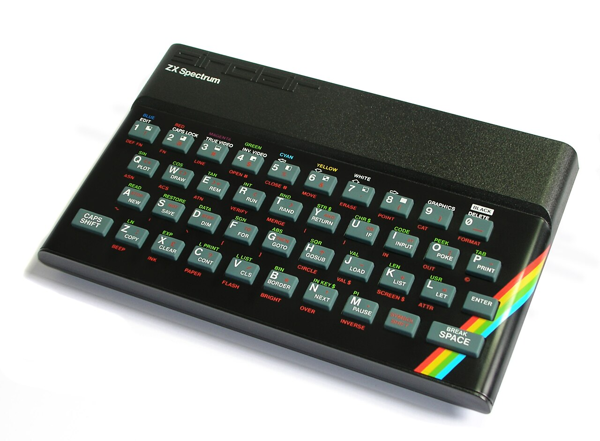
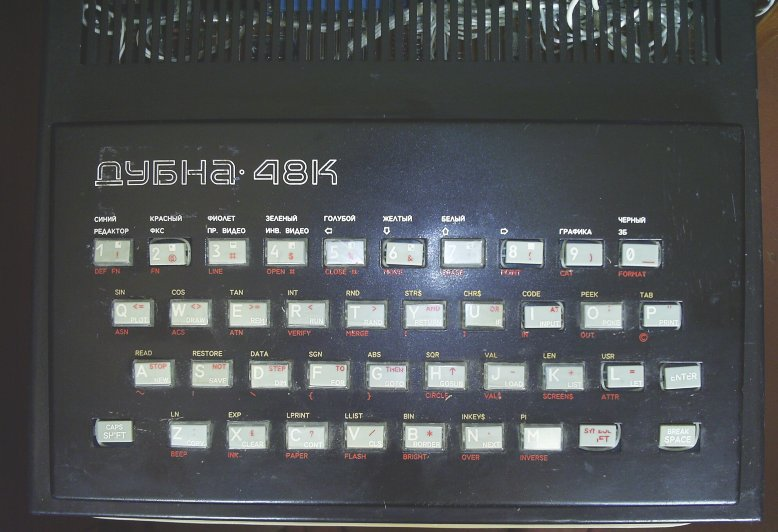
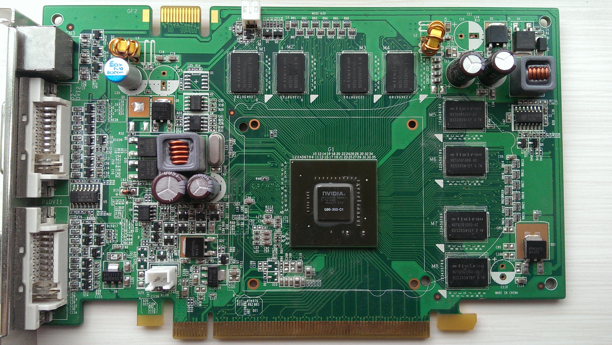

{#fig-hero .column-page}

{fig-alt="The Sinclair ZX Spectrum 48K home computer with its distinctive rubber keyboard and rainbow stripe"}

## Warning/Declaration

This is another attempt at producing a blog post based on a conversation/enquiry with Claude initially on my phone. Like [the previous one](../unpop/the-mortician/index.qmd) the contents are largely generated by the AI, but from a 'coproduced discussion'. Unlike the previous one I've aimed to edit and personalise this more, and refine it in later VS code sessions.

## Introduction

Many of my happiest early memories involved hisses, whirrs, screams, and pressing my fingers into soft, squidgy rubber. 

I'm talking, of course, about the ZX Spectrum 48K. I remember the confection of wires and cables, the ritual rewinding of the audio tapes, the sense of anticipation while the player loads and screams at me, the loadscreens and fit-inducing colour bars, then the relief when (or all too often if), many minutes later, the bytes successfully squeeze themselves onto the tiny computer's tiny memory.

I remember the sense of being entranced by worlds of abstraction, hearing beeps and samples and incidental machine sounds, the bright blocky 'overpainting' of colours on soft-edged cells thrown magically from the back of cathode ray tubes in front of me. I remember seeing and sensing something real, meaningful, responsive, enthralling, reactive, 'in there' which, in all honesty, often excited and engaged me more than anything 'out there' could offer. 

The ZX Spectrum wasn't built with games in mind. It was intended to be an affordable British solution to how to bring microcomputing out of the office, and into the home. But in Britain, it accidentally became synonymous with games. 

The official ZX Spectrum story lasted longer than we might expect, but was effectively over by the 1990s. 

But unofficially, the ZX Spectrum lasted longer still, in ways that were perhaps closer to the serious spirit of Sinclair's intent. Here's Claude to tell most of the rest of this story:

In 1993, in a flat somewhere in Moscow, someone is carefully soldering together a home computer. The design is based on an affordable home computer designed over a decade earlier — the Sinclair ZX Spectrum — but this version has features the original never had: a proper keyboard, a floppy disk interface, Cyrillic character support. Thousands of miles and several years away from its intended market, the Spectrum is enjoying a *ghost life*: an extended, unauthorised, and thoroughly transformed existence that its creators never planned and never profited from.

This pattern — technology escaping its original context and finding its most consequential applications somewhere entirely unexpected — turns out to be one of the most reliable dynamics in the history of computing. It happened with 8-bit home computers in the post-Soviet world. It happened with Nokia feature phones in East Africa. It's happening right now with graphics processors and artificial intelligence. And it happened, on the longest timescale of all, with a processor designed for a 1980s educational microcomputer that now powers most of the world's mobile devices.

Each case shares a common structure: a technology designed for one purpose proves transformative in another, the "inferior" platform enables innovations that the "superior" alternative hadn't achieved, and the conventional narrative of technological progress — newer is better, expensive is superior — turns out to be incomplete at best. But the differences between the four cases are as revealing as the similarities. Taken together, they tell us something important about how innovation actually works, which is messier, more contingent, and more interesting than the technology industry typically likes to admit.


## The 1990s: Sinclair's Soviet Afterlife

The ZX Spectrum was released in the UK in 1982 at a price of £125 for the 16K model. It was cheap, simple, and enormously popular — but by the early 1990s it had been thoroughly superseded: first in the home market by 16-bit machines like the Amiga and Atari ST, and then by IBM PC clones as they fell in price enough to absorb the home market too. By 1993, few people still had Spectrums plugged into TVs and monitors. Officially, by 1993, it was pretty much a dead technology.

In the former Soviet Union, it was just getting started.

{#fig-soviet-clone fig-alt="The Dubna 48K, a Soviet-manufactured ZX Spectrum clone computer"}

More Sinclair clones were produced in the former Soviet Union than in the rest of the world combined. The reasons were straightforward. Before the fall of the Iron Curtain, it was effectively impossible for enthusiasts to obtain genuine Western computer technology. Electronics hobbyists reverse-engineered smuggled machines, and the Spectrum's simplicity was its greatest asset: its ULA and Z80 architecture were far easier to clone with available Soviet-manufactured components than, say, the Commodore 64's custom SID and VIC-II chips.

The most popular clone families — the Pentagon and Scorpion series — weren't mere copies. Second-generation clones were based on the Spectrum 128 and incorporated the Beta 128 Disk Interface with TR-DOS firmware as standard, giving users floppy disk access. This produced a delicious irony: most British Spectrum owners never progressed beyond cassette tape loading, while their Soviet counterparts had disk drives as standard. The clones also gained AT keyboard interfaces and other adaptations that made them more practically capable than the originals.

The phenomenon had real industrial scale. The Byte clone, manufactured in Brest, was producing an average of 1,705 computers per month in 1992, with production continuing until 1995. The Pentagon PCB was copied across the entire former USSR between 1991 and 1996. A dedicated magazine, *ZX-Review* (ZX-Ревю), served a thriving community. An active demoscene pushed the hardware in ways Sinclair Research never anticipated.

```{mermaid}
%%| label: fig-spectrum-toc
%%| fig-cap: "Theory of change: The Spectrum's Soviet ghost life"
%%| fig-width: 8

flowchart TB
    A["ENABLING CONDITIONS<br/>Simple Z80 architecture<br/>Low component count<br/>Unavailability of Western tech"] --> B["MECHANISM<br/>Reverse engineering<br/>from smuggled units<br/>Local component substitution"]
    B --> C["LOCAL ADAPTATION<br/>Cyrillic keyboards<br/>Floppy disk interfaces<br/>AT keyboard support"]
    C --> D["EMERGENT ECOSYSTEM<br/>Magazines, demoscene<br/>Factory production<br/>Software development"]
    D --> E["OUTCOME<br/>Mass personal computing<br/>in post-Soviet states<br/>via 'obsolete' platform"]

    style A fill:#4a86c8,color:#fff
    style B fill:#5a9bd5,color:#fff
    style C fill:#6ab0e3,color:#fff
    style D fill:#7ac5f0,color:#000
    style E fill:#8adafd,color:#000
```

The Spectrum clones weren't a hand-me-down. They were an adapted technology that served their context better than the original served its own — and in some respects, better than the "superior" Western alternatives would have. A platform that required expensive peripherals, reliable mains electricity for hard drives, and a mature retail channel would have been useless. The Spectrum's constraints were features, not bugs.

There's a double irony here worth savouring. In Britain, Sinclair designed the Spectrum as a serious, affordable home computer — a tool for programming, education, and productivity. What it actually became was a gaming platform. In the former Soviet Union, the clone builders took a machine the British had used mainly for playing Manic Miner and Jet Set Willy, and put it to work running databases, word processors, and business applications — exactly the kind of serious use Sinclair had originally envisioned. The ghost life of the Spectrum was, in a sense, the life Sinclair had always wanted it to live.


## The 2000s: The Nokia 'Brickphone' and the African Leapfrog

A decade later, a structurally similar story played out at vastly larger economic scale.

Before they became the butt of "indestructible Nokia" memes, phones like the 3310, the 1100, and the 1110 were simply *everywhere*. Everyone had one, or knew someone who did. The Nokia 1100, launched in 2003, went on to sell over 250 million units — making it the best-selling mobile phone in history. At their peak in early 2008, Nokia commanded nearly 40% of the global handset market. For most of the 2000s, "mobile phone" effectively meant "Nokia."

Then came the iPhone in June 2007, and the brickphone's Western heyday was over almost overnight. Nokia's smartphone market share collapsed from over 50% to under 10% within five years. But here's the structural irony: M-Pesa launched in Kenya in March 2007 — three months *before* the iPhone. The brickphone's most transformative application began at almost exactly the moment it became "obsolete." While Western consumers were queuing outside Apple stores, African mobile adoption was accelerating on the very handsets the West was discarding. Feature phones still accounted for more than half of African mobile sales well into the mid-2010s.

Much of sub-Saharan Africa had never built out fixed-line telecommunications infrastructure. Landline penetration in many countries remained in low single digits as a percentage of population well into the 2000s. The sequential progression that Europe and North America had followed — physical telegraphy, then fixed copper to every premises, then data services layered on top — each stage taking decades and requiring enormous capital expenditure, simply hadn't happened.

Mobile telephony bypassed all of it. A cellular tower covers a wide area without requiring a physical connection to each user. The capital investment per person served is dramatically lower. And the handset cost falls on the individual consumer rather than requiring centralised infrastructure spending.

{#fig-nokia-mpesa fig-alt="A Nokia 1100 handset with M-Pesa on screen alongside Kenyan banknotes"}

This is where the brickphone's supposed limitations became genuine advantages. A phone that lasts a week on a single charge, survives being dropped on a dirt road, can be repaired at a local market stall, and works on a 2G network across vast areas with patchy coverage is not a compromised version of a smartphone — it is a *better tool for its context*. A smartphone in rural Kenya in 2008 would have been actively worse: no 3G coverage to justify its screen, no reliable electricity for daily charging, too fragile for dust and heat, too expensive, and too complex for the SIM toolkit banking that M-Pesa ran on. The Nokia wasn't an inferior alternative — it was an optimal fit for the actual constraints.

But the leapfrogging went far beyond voice telephony. M-Pesa, launched in Kenya in 2007 on basic Nokia handsets using simple SMS and SIM toolkit menus, allowed users to send and receive money, pay bills, and access basic financial services — all without a bank account. Large parts of East Africa effectively skipped the stage of widespread retail branch banking and went straight to mobile money. By 2011, 70% of the adult Kenyan population had an M-Pesa account [@jack2011], just four years after launch.

The scale became enormous. Claims that M-Pesa transactions equalled "half of Kenya's GDP" have been widely circulated, though this comparison needs care: as Dr Susan Johnson of the University of Bath pointed out [@johnson2014], comparing aggregated transaction flows with GDP (a measure of goods and services produced) is not conceptually valid. The figures are not equivalent measures. Nevertheless, the transformative impact on financial inclusion — reaching millions of previously unbanked people — is well-documented and genuinely remarkable [@suri2016].

```{mermaid}
%%| label: fig-nokia-toc
%%| fig-cap: "Theory of change: Nokia feature phones and mobile money in East Africa"
%%| fig-width: 8

flowchart TB
    A["ENABLING CONDITIONS<br/>No fixed-line infrastructure<br/>Cheap, robust handsets<br/>Existing mobile networks"] --> B["MECHANISM<br/>Mobile coverage via towers<br/>bypasses copper-wire stage<br/>Handset cost borne by user"]
    B --> C["LOCAL ADAPTATION<br/>Dual-SIM phones<br/>M-Pesa on SIM toolkit<br/>Agent network as 'branches'"]
    C --> D["EMERGENT ECOSYSTEM<br/>Mobile banking without banks<br/>Agricultural payments<br/>Microloans and insurance"]
    D --> E["OUTCOME<br/>Financial inclusion for<br/>millions of unbanked people<br/>via 'obsolete' handsets"]

    style A fill:#2d8a4e,color:#fff
    style B fill:#3da85e,color:#fff
    style C fill:#4dc66e,color:#fff
    style D fill:#6eda88,color:#000
    style E fill:#8eeea2,color:#000
```

The pattern echoes the Spectrum story. An "inferior" technology, adapted to local conditions, enabled an innovation — mobile banking without banks — that the supposedly superior smartphone-equipped West hadn't achieved. The leapfrog didn't just skip stages of infrastructure; it arrived somewhere genuinely new.


## The 2020s: Gaming GPUs and the AI Revolution

The third case follows the same "technology repurposed beyond its creators' intentions" pattern, but with characteristics that distinguish it sharply from the previous two.

Graphics Processing Units were designed to render video game graphics: a massively parallel workload of relatively simple, repeated mathematical operations across millions of pixels. It turned out that training neural networks involves a structurally similar workload — enormous numbers of matrix multiplications that can be parallelised. The hardware built to make games look beautiful proved, almost accidentally, to be the infrastructure needed to make deep learning practical.

The demand for ever-more-powerful GPUs was driven by a relentless graphical arms race in gaming. Quake (1996) drove the first wave of consumer 3D accelerator cards. Half-Life 2 (2004) pushed shader technology forward. And then came Crysis (2007), deliberately designed by Crytek to be "future-proof" — its highest settings were built for hardware that wouldn't exist for another three years. "Can it run Crysis?" became the defining question of PC gaming culture, a meme that persists to this day. Each generation of graphically ambitious games compelled millions of gamers to upgrade their hardware, creating the mass-market demand that made GPUs simultaneously cheap enough and powerful enough for researchers to repurpose.

{#fig-gpu fig-alt="An NVIDIA GeForce 9500 GT graphics card, representative of the gaming GPUs repurposed for AI research"}

The theoretical foundations for neural networks had existed for decades — backpropagation dates to the 1980s. What was missing wasn't the mathematics but the compute. CPUs could train neural networks, but their sequential processing architecture meant that scaling up was agonisingly slow. GPUs offered orders-of-magnitude speedups for the specific operations that mattered, and crucially, they were already mass-produced and relatively cheap because the gaming market had been driving down costs and driving up capability for years.

NVIDIA's CUDA framework, released in 2006 [@nickolls2008], was a key enabling step — it made general-purpose GPU computing accessible to researchers who weren't graphics programmers. The 2012 AlexNet moment [@krizhevsky2012], when a GPU-trained convolutional neural network dramatically outperformed traditional computer vision approaches, demonstrated that throwing parallel compute at large neural networks produced qualitatively different results. And the 2017 "Attention Is All You Need" transformer paper [@vaswani2017] provided an architecture — with its attention mechanism built on large matrix multiplications — that could fully exploit GPU parallelism during training.

The result was that the field went from "neural networks are interesting but computationally impractical" to the current era of large language models in roughly a decade, largely because existing mass-market gaming hardware could be repurposed rather than waiting for bespoke AI silicon to be designed, manufactured, and scaled from scratch.

```{mermaid}
%%| label: fig-gpu-toc
%%| fig-cap: "Theory of change: Gaming GPUs enabling the AI revolution"
%%| fig-width: 8

flowchart TB
    A["ENABLING CONDITIONS<br/>Mass-produced gaming GPUs<br/>Parallel architecture<br/>CUDA framework (2006)"] --> B["MECHANISM<br/>Matrix multiplication<br/>for neural networks maps<br/>onto GPU parallelism"]
    B --> C["KEY BREAKTHROUGHS<br/>AlexNet (2012)<br/>Transformers (2017)<br/>Scaling laws discovered"]
    C --> D["EMERGENT ECOSYSTEM<br/>Deep learning frameworks<br/>Cloud GPU services<br/>LLM training infrastructure"]
    D --> E["OUTCOME<br/>AI capabilities advance<br/>by decades in ~10 years<br/>via repurposed gaming hardware"]

    style A fill:#7b2d8a,color:#fff
    style B fill:#9b3da8,color:#fff
    style C fill:#b54dc6,color:#fff
    style D fill:#cc6eda,color:#000
    style E fill:#e08eee,color:#000
```


## Points of Symmetry

Across all three cases, the structural parallels are striking.

**Mass production drove affordability.** In each case, the enabling technology was produced at scale for a large consumer market, which drove costs down to the point where repurposing became viable. The Spectrum was cheap because Sinclair designed it to bring computing into ordinary homes. Nokia handsets were cheap because they served a global mobile market. GPUs were cheap (initially) because gamers bought millions of them.

**Adaptation, not mere adoption.** None of these cases involved using the technology as-is. Soviet clones gained disk interfaces and Cyrillic support. Nokia handsets were paired with M-Pesa's agent network and SIM toolkit menus. GPUs were made accessible through CUDA and later through deep learning frameworks like TensorFlow and PyTorch. The interface layer that unlocked the new use case was as important as the underlying hardware.

**The "inferior" platform enabled the superior innovation.** British Spectrum users were still loading from cassette while Soviet clone users had floppy drives. Western banks hadn't achieved the financial inclusion that M-Pesa delivered on feature phones. And the AI revolution didn't wait for purpose-built AI chips — it happened on gaming hardware.

**The conventional progress narrative was wrong.** In each case, the standard assumption — that the most sophisticated available technology is the best tool for any job — proved false. Simpler, cheaper, more robust technology served the actual context better.


## Points of Difference

The differences are equally instructive.

| | Spectrum Clones (1990s) | Nokia / M-Pesa (2000s) | GPU / AI (2020s) |
|---|---|---|---|
| **Direction** | Rich to poor context | Rich to poor context | Between use cases |
| **Mechanism** | Unauthorised, bottom-up | Commercial, deliberate | Academic then corporate |
| **Feedback to original** | None | Minimal | Competitive tension |
| **Creator benefit** | Zero | Significant | Transformative |

: Comparing the three cases: mechanism, direction, and feedback effects {#tbl-comparison}

**The direction of flow differs.** The Spectrum and Nokia cases involved technology flowing from wealthier to poorer economic contexts. The GPU case is different: it's technology flowing between *use cases* within the same economic context. Nobody would describe AI researchers at Stanford or Google as an underserved market in the way that post-Soviet households or unbanked Kenyans were.

**The mechanisms of adoption differ.** The Spectrum clones were entirely unauthorised and bottom-up — hobbyists reverse-engineering smuggled hardware. M-Pesa was a deliberate commercial venture by Safaricom and Vodafone, which happened to leverage existing cheap handsets. GPU repurposing was initiated by academic researchers (notably at the University of Toronto and Stanford) and then attracted enormous corporate investment. Three different mechanisms producing structurally similar outcomes.

**The feedback effects differ — and this is the most consequential distinction.** The Soviet Spectrum clones had no impact whatsoever on Sinclair Research or the British home computer market. Nokia's African success was commercially valuable but didn't reshape Nokia's core business. But the GPU case has created a genuine competitive tension between the original and repurposed markets. NVIDIA's market capitalisation and product roadmap are now driven primarily by AI demand rather than gaming. Consumer GPU prices have been pushed upward by AI and cryptocurrency demand. The repurposed technology hasn't just found a new market — it's reshaping the original one.

Valve's new Steam Machine, announced in November 2025 and planned for early 2026, has already faced delays and a possible price hike due to memory and storage shortages driven partly by AI data centre demand. The technology that was repurposed from gaming is now, in a sense, competing with gaming for the same resources. It would be as if the success of M-Pesa had somehow driven up the price of Nokia handsets to the point where fewer people could afford them.

There's a further irony here. Even as AI inherits gaming's appetite for ever-more-powerful GPUs, gaming itself has been quietly moving away from the graphical arms race. The Nintendo Switch, launched in 2017 with hardware far less powerful than its competitors, has sold over 150 million units — the third best-selling console of all time. Valve's Steam Deck prioritises portability over raw performance. The most successful gaming hardware of the 2020s has been built around "good enough" graphics and the freedom to play anywhere, not around pushing pixels to their photorealistic limit. Gaming, it turns out, is rediscovering something the Nokia brickphone already knew: the best device isn't the most powerful one. It's the one that fits your life.


## The Circle Closes

There's one more ghost life hiding in this story, and it threads all three cases together.

The Nintendo Switch — that 150-million-selling triumph of portability over power — runs on an ARM processor. ARM stands for Acorn RISC Machine. Acorn Computers made the BBC Micro, the Spectrum's direct rival in the early 1980s British home computer market. While Sinclair was building the cheap, cheerful machine that would accidentally become a gaming platform in Britain and a serious computer in the USSR, Acorn was building the "serious" educational computer commissioned by the BBC's Computer Literacy Project.

In 1983, Acorn's engineers — Sophie Wilson, who had written BBC BASIC, and Steve Furber — began designing a new processor to succeed the BBC Micro's ageing 6502 chip. The first ARM silicon worked on its very first test, on 26 April 1985. Its initial use? As a second processor for the BBC Micro itself. ARM was spun off from Acorn in 1990 as a joint venture with Apple and VLSI Technology.

ARM's low-power RISC design turned out to be perfectly suited to battery-powered devices. By 2005, 98% of the world's mobile phones used at least one ARM processor — including the Nokia brickphones that enabled M-Pesa, and the iPhones that killed them. ARM now powers virtually every smartphone on the planet, the Nintendo Switch, and increasingly, the data centre servers that train AI models.

And then, in 2020, Apple completed the migration. Having used ARM in every iPhone and iPad since the beginning, Apple announced it was replacing Intel processors in its Mac laptops and desktops with its own ARM-based M1 chip. The same architecture that had conquered mobile was now powerful enough for professional computing. Every MacBook, iMac, and Mac Studio now runs on a direct descendant of the chip Sophie Wilson designed for the BBC Micro. In a sense, a modern Mac has more in common architecturally with an iPhone than with the Intel Macs that preceded it. The distinction between "phone chip" and "computer chip" — which had seemed fundamental — turned out to be temporary.

So here is the deepest irony of all: the BBC Micro — the Spectrum's serious, educational rival from 1981 — gave birth to the chip architecture that now powers phones, tablets, laptops, desktops, game consoles, and AI servers. The ghost life of the BBC Micro isn't a specific device or a specific market. It's the invisible substrate on which most of the modern computing world now runs. The Spectrum got the games, and Sinclair got the nostalgia. Acorn got the future.


## What the Pattern Reveals

The technology industry's preferred narrative of innovation is one of intentional design: visionary founders seeing the future and building towards it. The actual pattern, repeatedly, is that the most consequential applications of technology are the ones nobody planned.

The ZX Spectrum wasn't designed to democratise computing in Russia. Nokia didn't set out to replace banking. NVIDIA didn't build GeForce cards to enable artificial intelligence. And Sophie Wilson and Steve Furber, designing a new processor for the BBC Micro in 1983, were not laying the foundations for the entire mobile computing era. In each case, the transformative application emerged from the interaction between a technology's inherent properties and the specific constraints of a context its creators weren't thinking about.

This suggests something important about the relationship between technological sophistication and practical utility: they're not as correlated as the industry likes to assume. The "appropriate technology" — a term that has accumulated some patronising connotations but describes a real phenomenon — isn't always the newest or most powerful. It's the one that fits the actual constraints: economic, infrastructural, social, and practical. And sometimes the ghost outlives the original by so long that it stops looking like an afterlife and starts looking like the main event. ARM is now so fundamental to modern computing that its origins in an early-1980s educational microcomputer feel almost absurd — but that's exactly the point.

It also suggests that if the pattern holds, the most important application of some current technology is probably one we haven't recognised yet. It may well be happening right now, in some context the technology's creators aren't paying attention to — perhaps using hardware considered obsolete, in a market considered marginal, solving a problem considered someone else's.

The ghost life of tech continues. We just don't always know where to look for it.

---

*This post grew out of a conversation about the relative success of the Commodore 64 and the Amiga in the UK home computer market, which led — via Soviet Spectrum clones, Kenyan mobile money, and GPU architecture — to some reflections on how technologies find unexpected second lives. Sometimes the best conversations are the ones that refuse to stay on topic.*
