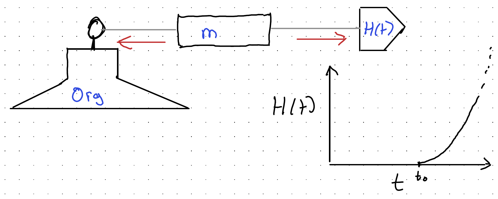
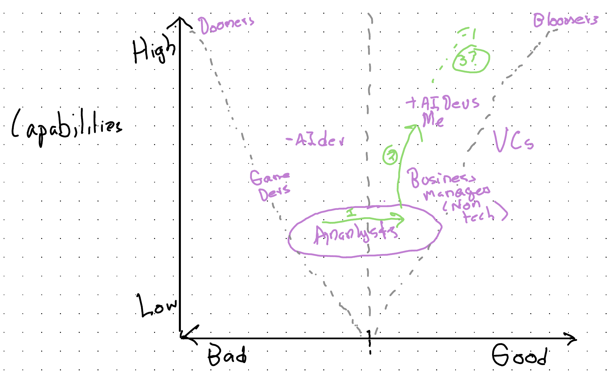

## Background

I started my company focused on helping analytical knowledge workers get the most from Agentic AI, Knowledge Tree & Butterfly, on the 1st of September. So, it's now been running for slightly over a month. So far, it's been an enriching experience in every way but financially, with many interesting conversations, but no commissions.

Where analytical knowledge workers in the UK - fields like statistics, economics, epidemiologists, quantitative academics and so on - are on AI adoption and usage for their work is far behind where I'd have expected them to be by this point. Whereas the capabilities of reasoning models in code harnesses still appears to be improving at an exponential pace, exposure and engagement with such tools still seems low, and the relevance and value of such models little understood beyond software development. (And even within software development, within the UK, it seems in places things have changed much less than I'd have expected.)

A visual metaphor: we have a column of some kind of material - say wood, metal, plastic, glass - which is tethered to an anchor at one end, and on the other end is being pulled by a fleet of horses, the number of whom keeps doubling with eerie regularity. The column is analytical knowledge workers' current way of doing their work; the anchor is the organisation in which such work is done; the tether the set of requirements and expectations placed on the worker by their organisation and broader cultural milieu; and the growing fleet of horses the capabilities and potential for getting the same work done better now made possible by agentic AI at or near the frontier.

{#fig-tension fig-alt="Hand-drawn diagram: a stick figure standing on a block labelled Org is tethered to a box labelled m, which is pulled the other way by an arrow-shaped block labelled H(t). Red arrows show the opposing forces. An inset plot shows H(t) against t, flat until t0 and then rising steeply."}

There are important variations allowed by this metaphor: the type of material, initial position of the anchor, the length and properties of the tether, the number of horses, how many are getting attached to column, and so on. But there's also a defensible default expectation about what will happen to the columns: unless other parts of the setup change most, eventually, will **snap,** as they are being subject to ever increasing tension, and unless other parts of the system change the column itself will become the failure point. Some types of material, like plastic, will tend to distend rather than snap, some metals will resist the forces pulling at them longer, but qualitatively, as the metaphor is a description of a system under tension, the question is simply **when** the forces exerted by the fleet of horses lead to a change in the material, not **whether** such a change will occur.

That, fundamentally, is the prediction my business is founded on: Agentic AI capabilities, and their transformative potential for analytical knowledge work, are already so far advanced of how most of such work is currently being done, and how most organisations allow such work to be done (the anchor and tether), that it's a large, growing, and often unacknowledged force in analytical process and workflow improvement.

The hope of my business is to help analytical knowledge workers to avoid getting broken by this **snap**. To show how to move and adapt with the Agentic frontier, rather than find yourselves and your organisations broken by failing to change quickly enough.

What follows is Opus 5.5's attempt to render a late night reverie of rapid fire prompts from me, meditating on these same ideas, into something like an evidenced and coherent essay. Within this reverie the metaphor I chose was simpler, more immediate, than the column-under-tension example above: simply the force of gravity, and the way in cartoons it interacts with perception.

## Cartoon physics

In the cartoons, it is Wile E. Coyote, not the Road Runner, who runs off the edge of the cliff. He keeps running, suspended over nothing, and only falls when he looks down. The Road Runner - small, fast, adapted to the desert - never falls at all.

(In [earlier posts](../analytical-maxim-gun/index.qmd) I wrote about "the Roadrunner who looks down". Wrong character: the Road Runner never needs to.)

Cartoon physics has one law that real physics lacks: consequences wait for you to notice them. And a great many organisations are behaving, with respect to agentic AI, as if they lived under it - as if the ground will stay there until they have formally reviewed whether it is still there.

It won't. **Gravity is not a democratic law.** It does not wait for a majority, a steering group, or the next budget round. It applies to everybody who has run off the edge, whether or not they have looked down.

## The mislabelled map

Here is a simple map. One axis asks whether AI's effects will be *incremental* or *revolutionary*. The other asks whether they will be *good* or *bad*.

{#fig-map fig-alt="Hand-drawn chart. The vertical axis is capabilities, from low to high; the horizontal axis runs from bad to good. Dashed lines fan out from the bottom centre in a V shape, reaching Doomers at top left and Bloomers at top right, with a dashed vertical line up the middle. Labels include Game Devs and minus AI dev on the bad side, and Business managers (non-tech), VCs, plus AI Devs and Me on the good side. Analysts are circled near the bottom centre, with green numbered arrows 1, 2 and 3 tracing a path right and then upwards towards higher capabilities."}

The public debate is usually staged as **doomers** against **bloomers**: will AI be very bad or very good? That debate runs up and down the *right-hand* column. They disagree about the sign but agree about the size. Both are revolutionaries.

So the fault line that matters runs *between* the columns: revolutionary against incremental. And most organisations sit on the incremental side not by decision but by default. Nobody chose it; it is simply where you are standing if you have not moved.

Which is the Coyote's position exactly. He didn't decide to stand on thin air. He just kept doing what he was doing.

## Your budget is your forecast

So how do you tell which side an organisation is really on? Don't ask what it says. Look at what it spends.

Economists since Samuelson have distinguished *stated* from *revealed* preference, and Hayek's broader point was that the way resources are allocated carries knowledge nobody need ever state out loud. **Your budget is your forecast**, whether or not anybody wrote it down as one.

Here is a real example from public procurement data. In April 2026, the Office for National Statistics published an award of £9.8m for ["SAS 9 and Viya 4 Software Licensing"](https://www.contractsfinder.service.gov.uk/Notice/06513c12-0d3f-4f87-9bcf-012690136a49). In September 2026, it published an award of £75k for ["Social Surveys AI Adoption Support Services"](https://www.contractsfinder.service.gov.uk/Notice/8e1143cb-63f1-46ef-9c89-8f87eff53fdd). (A caveat: awarded values on Contracts Finder can be multi-year ceilings rather than annual spend, so the ratio shouldn't be read too literally.)

This is not a cheap shot at the ONS. The point is that it is *typical*, and rational from the inside: the licences keep statistical production running, and the adoption contract is a sensible, cautious step. But side by side the two numbers make a forecast: the next several years will look much like the last several, with some AI helping at the edges.

Nor is the ONS unusual. A keyword scan of UK public procurement notices (Contracts Finder, Find a Tender and Public Contracts Scotland) found 31 awarded contracts over the last year, worth about £16m, for Copilot-style "AI adoption" - for example the Crown Prosecution Service's ["Provision of Microsoft Copilot Enablement Programme"](https://www.contractsfinder.service.gov.uk/Notice/fc8eccfc-6069-4f41-911e-57d19c21303e) and the DWP's ["Copilot Adoption Support Services"](https://www.contractsfinder.service.gov.uk/Notice/fed3a8fd-c580-4172-b1df-aa6323f7b595). <!-- CHECK: 31 awarded / ~£16m is the radar's tightened 'paper_straw' label (ktandb-business Tracking/radar/2026-10-04/report.md, ~90% precision on a 10-notice spot-check). Values can be framework ceilings. Possible addition: CPS withdrew a £6.8m 'Microsoft Co-Pilot' procurement (FTS, Dec 2025) before buying the £354k enablement programme; verify first. --> That is the stated belief in transformation, expressed as a revealed belief in assistance.

## Paper straws

In 2015 a video of researchers pulling a plastic straw from a sea turtle's nostril went viral. <!-- CHECK: video year (2015) and that it was filmed off Costa Rica by Christine Figgener's team. --> Straw bans followed, in cities and companies around the world. But straws are a tiny share of the plastic entering the oceans. <!-- CHECK: source for straws' share of ocean plastic; avoid quoting a specific percentage unless sourced. --> The ban was the *visible* action, not the effective one.

Copilot-style assistants are **paper straws**. They are visible. They are budgetable: a per-seat licence, a training programme, an adoption partner. They give the board something to see. And they leave workflows, roles and - most importantly - people's conception of what their job *is* entirely untouched.

Even the name is reassuring. "Copilot" tells you that you are still the pilot. (Though in commercial aviation the co-pilot is a fully qualified pilot who flies much of the time, and much of the flying is done by the autopilot anyway. <!-- CHECK: first officers are fully qualified and commonly fly alternate sectors; autopilot handles most of cruise. --> The metaphor contains its own subversion.)

Worse, paper straws can act as **inoculation**. A weak dose - an assistant bolted onto Word and Outlook, for staff whose work is otherwise unchanged - disappoints, and the disappointment becomes evidence: *we tried AI; it was overhyped*. This is exactly the factory owner in the [steam-loom parable](../why-tech-incrementalism-fails/index.qmd), who converts a quarter of the factory, finds output falls, and concludes - correctly, about the hybrid; wrongly, about the technology - that steam doesn't work. The weak dose produces antibodies against the strong one.

To be fair, small acts cut both ways. A small commitment can be a foot in the door, making larger ones easier. It can also be moral licensing: having done something, we feel entitled to do nothing more. Which wins is an empirical question, and I don't know the answer for any particular organisation. I do know which is more comfortable.

## Right about the facts, wrong about their meaning

There is a respectable, historical case for patience. In 1990 the economic historian Paul David published a paper, "The Dynamo and the Computer", arguing that electricity took decades to show up in manufacturing productivity, because the gains only came once factories had been physically reorganised around electric motors rather than around a single central drive shaft. <!-- CHECK: Paul A. David (1990), "The Dynamo and the Computer: An Historical Perspective on the Modern Productivity Paradox", American Economic Review 80(2), Papers & Proceedings, 355-361; confirm the 'roughly four decades' framing if used. --> The lesson often drawn for AI: relax, general-purpose technologies take a generation.

The historians are right about the facts and wrong about their meaning. David's own argument is that the lag was organisational. Slow adoption measures how slowly organisations *turn*, not how small the technology is. As I put it [last year](../2025-last-human-majority-knowledge-worker/index.qmd), the turning circle of the organisation is the financial year. That is a statement about the ship, not about the sea.

Which is why the two sides of the fault line struggle to persuade each other. In Kuhn's terms, they are not disagreeing about the evidence so much as about what *counts* as evidence. The incrementalist looks at aggregate productivity statistics and sees nothing much. The revolutionary looks at what one analyst with agents can now do in an afternoon, and sees everything. Each regards the other's evidence as noise.

## Why analysis is next

Software development fell first, for four reasons, I think:

1.  Its artefacts are text.
2.  Its correctness is cheaply checkable: the code runs or it doesn't; the tests pass or they don't.
3.  Its tools were already scriptable, built to be driven by other programs.
4.  Its practitioners built the AI tools, and built them for themselves.

Analytical knowledge work - statistics, data science, research, evaluation, much of what an organisation like the ONS does - shares the first three. Its outputs are code, tables and prose. Much of its correctness can be checked by rerunning it. Its tools (R, Python, SQL, even SAS) are scriptable. It lacks only the fourth: nobody built the tools with analysts specifically in mind.

That is not much protection. On a Wardley map, bespoke analysis is moving rightwards, from custom-built towards product and commodity: what made an analyst's work feel artisanal is becoming something you can specify, generate and check.

## Two cultures of concealment

If this is happening, why is it so quiet? Partly because people hide it, in two different ways.

In academic settings, people often *say* they avoid AI but quietly use it - Ethan Mollick's **secret cyborgs** - treating it rather like a performance-enhancing drug. The concealment is about use.

In business settings, the pattern inverts. People *say* AI is "transformative". What many of them fear is that it is transformative *and bad for them*. So they behave incrementally, hoping a Copilot licence and a training course will tame it. This is **negotiating with gravity**: an attempt to agree terms with a force that does not negotiate.

The common root, I suspect, is not pay but identity. Akerlof and Kranton's identity economics argued that people's choices are shaped by their sense of who they are and what people like them do. For a professional, the threat is not only to income but to the story of being someone whose expertise is hard-won and needed. Concealing use protects that story in one culture; performing enthusiasm while changing nothing protects it in the other.

## Megafauna

Large organisations have something like homeostasis: they are built to keep a stable internal environment whatever happens outside. That is usually a strength. It keeps the payroll running through a recession.

But the same stability is what stops staff *feeling* the change outside. The building stays at twenty degrees whatever the weather. The organisation's [turning circle](../2025-last-human-majority-knowledge-worker/index.qmd) is the financial year; the technology's is a few months.

Small organisms adapt faster; they were never standing on that cliff in the first place. And staying inside a large organisation gives a reassurance that is real but **borrowed**: lent by the organisation's size and inertia, and liable to be called in.

## The bet

Being early looks exactly like being wrong. But when the payoffs are lopsided - a modest cost if the change turns out incremental, a severe one if it turns out revolutionary and you didn't prepare - the bet can be rational under real uncertainty. This is roughly Taleb's barbell: keep most of what works safe, and put a deliberate, non-trivial share into the outcome that would hurt most to miss. (There is a particular feeling, writing posts like this, of being Cassandra with a blog. I'm aware that Cassandra with a blog is also a description of most blogs.)

## Scaffolding

Unlike the Coyote, we are not obliged to wait for the fall. As one of the machines put it, replying to [the Maxim Gun post](../analytical-maxim-gun/index.qmd): unlike cartoon physics, we can build scaffolding before the fall.

That means rebuilding workflows around agents, not bolting assistants onto the old ones, and measuring whether it worked. It is, for what it's worth, what we do at [KT&B](https://ktandb.co.uk): we help analytical teams rebuild their workflows around agents, with receipts, and measure the result on errors, reproducibility and time - in that order.