## About this post

This post is an AI transcription of [the original handwritten notes on repeated measures](../repeated-measures/index.qmd), written on a reMarkable tablet as a single ultra-long page (1620 × 73,475 pixels). It is the **second** transcription attempt of the same source: the first, by Claude Opus 4.6 in February 2026, is [here](../repeated-measures-transcribed/index.qmd), and remains unchanged as a record of what that model could do at that time.

That's the point of keeping these as separate, dated posts rather than correcting earlier attempts in place: the same fixed source document, revisited by successive models, becomes a small longitudinal benchmark for how AI parsing of dense handwritten technical material — mixed prose, equations, diagrams, code, and colour — improves over time.

The transcription challenge was never just reading the words. It was also **demarcation**: deciding which portions of the canvas are prose, and which are figures, tables, glyphs, annotated equations, or boxed notes. The first attempt's crops swallowed whole paragraphs of body prose into "figure" images. This attempt went back to the source scan and re-segmented the canvas from scratch: Claude Fable 5 (July 2026) read all 27 native-resolution slices and transcribed the text, while a team of Claude Opus 5 agents independently demarcated every non-prose entity with tight pixel boundaries. Every figure below is a fresh crop from the original scan, cut to hug the graphical content; everything that is prose — including prose the first attempt left trapped inside images — is text.

Where the original handwriting is in colour, this transcription renders it in colour too: [green passages]{style="color: #2e8b57;"} mark Jon's detailed discussion and answers; boxed notes appear as coloured callouts. Colours inside the figures — blue diagram labels, red annotations, highlighter boxes on equations — appear exactly as drawn.

---

## Repeated Measures

Apropos of nothing specifically, I've been thinking a lot recently about repeated measures data, and how such data should be modelled.

### Our (Fictitious) Problem

Say we're interested in knowing how one of two possible supplements aids with weight gain. (This may be a science-fiction-like example given the current obesogenic environment we're in, but go with me for now), and we're interested in these two supplements' effects in the real world, not just in mice bred to be, effectively, like clones.

Because of this, we have some variety in initial shapes and sizes of our population:

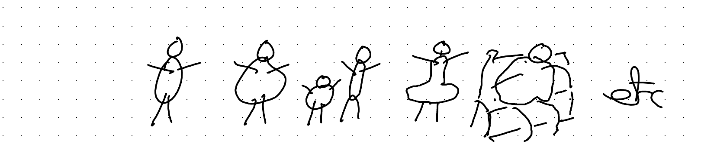

If we could recruit many, many subjects, this variety in starting weight and other initial characteristics, this variety wouldn't matter too much. We can randomise subjects to Sup A or Sup B, and through the miracles of the randomisation process on average the starting characteristics of subjects in the two arms will be the same.

However, our budget is finite, and can only stretch to tens, not hundreds or thousands, of subjects in each arm.

And, all subjects have a weight at the start, before we treat them with Sup A or Sup B.

Obviously, the subjects' starting weight can't be attributed to Sup A or Sup B. It's what they came with. So any claims about the weight adding effects of the supplements can only be based on how the weights of subjects changes over the course of the study.

One good thing about the study, however, is that each subject's weight is measured multiple times over the course of the study, not just the start and end.

### Understanding the Data

With our data and problem described, let's now start to think about what the data we're working with might look like, and how to better visualise and understand it.

We can start by imagining how the data might come to us, or what it might look like after some data cleaning and reshaping.

As I've discussed before, almost all data we can model comprises some big rectangle of numbers and values $D$, with:

i) one row per observation
ii) one column per variable

(This is the definition, in brief, of Tidy Data)

So, the first few rows of our data might look something like this:

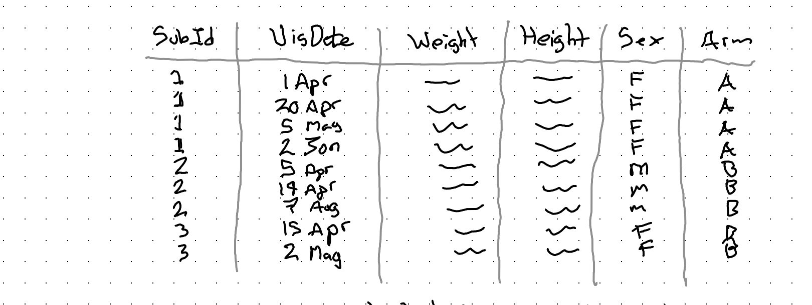

Let's try to understand this data by asking ourselves a series of questions:

#### 1) What is our observational unit?

::: {style="color: #2e8b57;"}
Each row is an observation. Each row shows the characteristics of a subject on a given date, so our observational unit is: Subject-Dates.

More abstractly, we can say each unit is a time-person.
:::

#### 2) What is our treatment variable, T?

::: {style="color: #2e8b57;"}
This is the variable Arm, which is either:

- A – Supp A
- B – Supp B

(So, we'll want some way of comparing changes in response for people in Arm B compared with Arm A)
:::

#### 3) What is our response variable (Y)?

::: {style="color: #2e8b57;"}
This definitely *involves* the weight column, but it might not *just* be the weight column.

Firstly, we know it needs to involve *change* in weight, because each subject had some weight at the start, that we know can't be caused by the supplement, which they only started taking at the start of the trial.

Secondly, we might want to account for the *height* as part of outcome/response, as someone who's taller can probably change weight more easily than someone who's shorter. (Something to ponder...)
:::

#### 4) What are our control variables (X)?

::: {style="color: #2e8b57;"}
If we have a big enough sample then we might not need control variables. But with our small dataset we should definitely consider sex as a control variable.

We might also wish to consider starting weight as a control variable, as well as maybe height.

However, given our discussion about the response variable above, we might not want to plug height in as a control in the standard way, and instead use it as part of our derivation of the response instead.

There are also nonstandard approaches to consider for controlling for starting weight too, which come about from pondering the next question.
:::

#### 5) Are our observations independent?

::: {style="color: #2e8b57;"}
This question might sound like it's coming out of left field, but it's really central to how we can think about and approach modelling this kind of data.

Independent (& identically distributed) are two standard assumptions made when deriving most stats models. If our data aren't independent then the assumptions aren't correct, and so neither will what our model estimates be.

In the case of our data, we know our data aren't independent in one very obvious and important way.

They're nested.

Specifically, our observations (each row in the dataset) are time-persons. And we know each time-person is 'nested within' a grouping variable called a person (or subject).

Graphically we can represent this grouping as follows for the rows shown in the dataset above:
:::

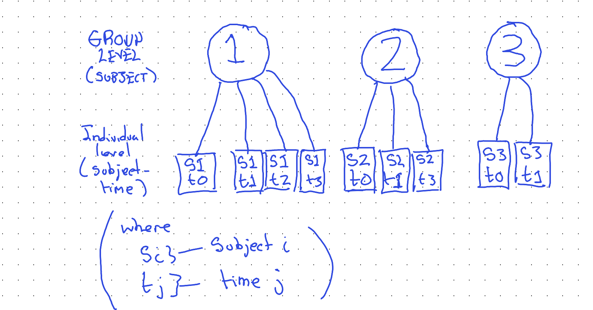

::: {style="color: #2e8b57;"}
Our awareness of this grouping relationship will be critical both for how we continue to visualise the data, and for how we model the data.
:::

### Visualising the data

Having now thought through the problem and data we have, we can start to come up with some ideas for visualising the data effectively. (Which will, in turn, help us choose an appropriate model specification.)

Two things we know:

i) Observations are grouped into subjects
ii) Earlier visits happen before later visits.

Obvious, really, but also really helpful for looking at the data the right way. A slightly less obvious thing we should have seen from the data is that subjects had their first visit on different dates (and that not all subjects had the same number of visits, nor were visits spaced out equally far apart.)

So, maybe our graphing canvas should be set up as follows:


Given the above design decisions, our main statistical graphic for this kind of data might look something like the following:

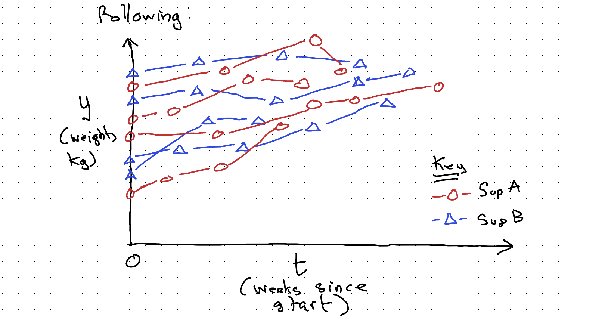

With this kind of visualisation, complicated though it is, it should at least be apparent that there's an upwards drift in weight over time. We also have some sense of the number of subjects (not observations) in the study; we can maybe temper our expectations a little about whether our main question of interest — whether Sup A or Sup B are better for weight gain — can be answered in a way that shows a statistically significant difference even if there's a substantive difference really between the two supplements. We might well be underpowered (mainly because I didn't want to spend too long drawing dots and lines!)

But we can still use this kind of visualisation, along with everything else we understand about the data and data generating process (DGP), to try to figure out the best way of modelling the data we have.

### Towards modelling

What's our simplest possible model? It's probably the mean.

Yes, the mean is a model. It's the linear regression of y (our weight response value) against the intercept:

$$M1: \quad y = \alpha + \epsilon, \qquad \epsilon \sim N(0, \sigma^2)$$

In R, something like:

```r
mod01 <- lm(weight ~ 1,
             data = data)
```

Graphically:

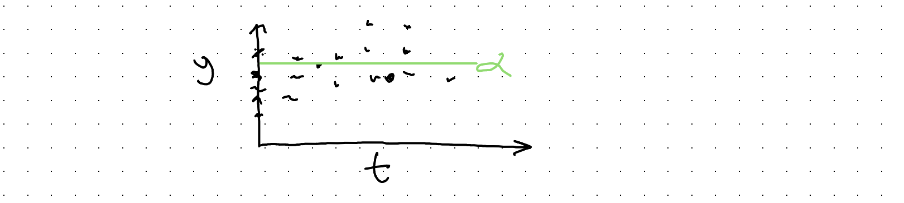

Not a very useful model. Let's try to do better, firstly by accounting for the two arms (Supp A or Supp B).

$$M2: \quad y = \alpha_0 + \alpha_B + \epsilon, \qquad \epsilon \sim N(0, \sigma^2)$$

$$\text{where } \alpha_B = \begin{cases} 1 & \text{iff } Supp = B \\ 0 & \text{iff } Supp = A \end{cases}$$

In R, something like:

```r
mod02 <- lm(wt ~ is_supp_B,
            data = dta %>%
              mutate(
                is_supp_B = ifelse(
                  Supp == "B", 1, 0)
              )
            )
```

And graphically:

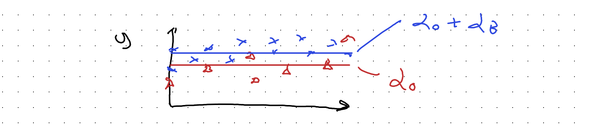

So, $\alpha_0$ is the mean of y for Supp A, and $\alpha_0 + \alpha_B$ (not $\alpha_B$ alone) the mean of y for Supp B.

This might look like an improvement, but in some ways it's not. It's a wrong turn. For instance, what would happen if Supp B really causes the most weight gain, but the average subject in the Supp A arm both tends to be heavier and to be visited more often and to exit the study earlier?

With this kind of model, we might end up thinking Supp A, not Supp B, is 'better' because its model-implied mean value is higher.

In both of the models so far, we haven't yet modelled the effect of time. Let's look at that:

$$M3: \quad y = \alpha + \beta t + \epsilon, \qquad \epsilon \sim N(0, \sigma^2)$$

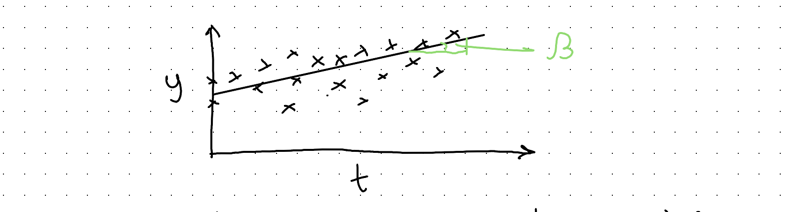

```r
mod03 <- lm(y ~ days_since_start,
            data = dta)
```

Great, now we've got a coefficient for capturing the trend over time. However, we haven't included some way of representing:

i) the subject membership of observations
ii) the difference in growth trends between supplement arms

Let's start with the second issue. One naive approach would be to include a coefficient for a flag variable, which is 1 if the arm is Sup B, but 0 otherwise.

$$M4: \quad y \sim \alpha_0 + \alpha_B + \beta t + \epsilon, \qquad \epsilon \sim N(0, \sigma^2)$$

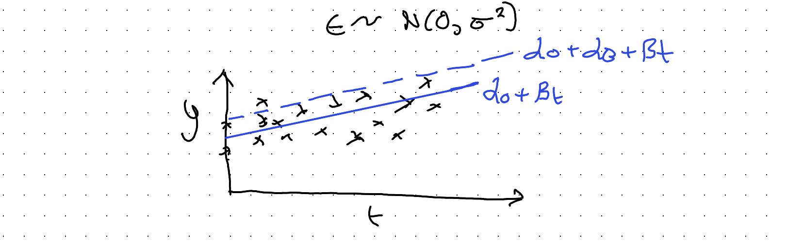

But again, like M02, this doesn't actually allow for the *trend* to be different between the two arms, which is what we need to try to calculate.

In M02 and M04, we have in effect 'split' the $\alpha$ parameters controlling the intercept, in two:

$$\alpha \rightarrow \alpha_0 + \alpha_B$$

The clue to the solution is to realise this same kind of coefficient 'splitting' that we've applied to the intercept parameter $\alpha$ can also (or instead) be applied to the slope coefficient $\beta$:

$$y \sim \alpha + \beta t$$

$$\beta \rightarrow \beta_0 + \beta_B$$

[(where $\beta_B$ = 1 iff arm = B, 0 otherwise)]{style="color: #2e8b57;"}

Substituting:

$$M5: \quad y \sim \alpha + (\beta_0 + \beta_B)t$$

So, we now have another coefficient $\beta_B$ (to be determined) that allows a different slope for Supp B than Supp A.

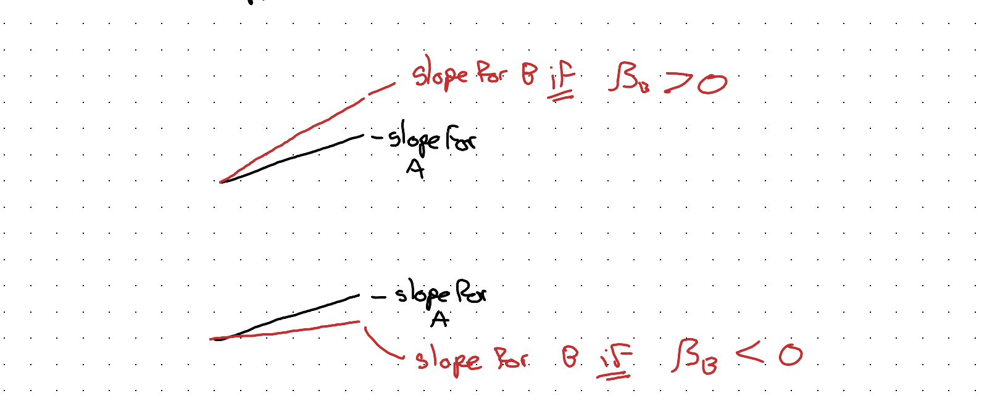

::: {style="color: #2e8b57; border: 1px solid #2e8b57; border-radius: 4px; padding: 0.5em 1em;"}
**Note:** As $y \sim \alpha + \beta t$ is *nested in* (a restricted version of) $y \sim \alpha + (\beta_0 + \beta_B)t$ we can run an **F-test** as one way of testing if Supp B has a diff slope to Supp A.
:::

This kind of model spec helps for comparing the slopes, but now we've neglected the fact of observations being grouped in subjects. [(& subjects have different initial weights)]{style="color: #2e8b57;"}

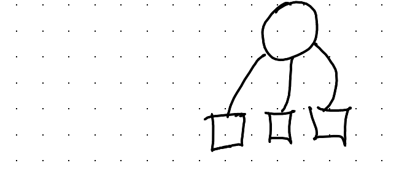

How do we try to account for this too?

### An 'Interesting' Detour

Maybe we shouldn't be thinking about one model, but

## MANY Models ??!

If we arrange the data into many facets, one for each subject, we can do a simple regression for each subject series?

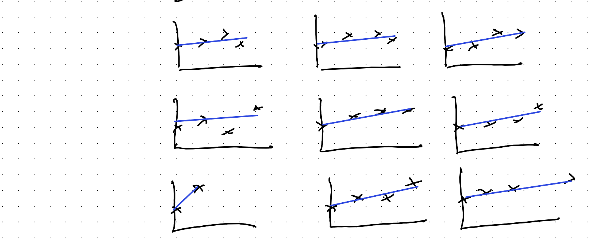

We could compare the slope coefficients for each of these series, and maybe see if the types of slope coefficient for Supp A arm looks different to that for Supp B arm.

We could even represent our uncertainty in the coeffs visually, producing something like a forest plot (used in meta analysis):

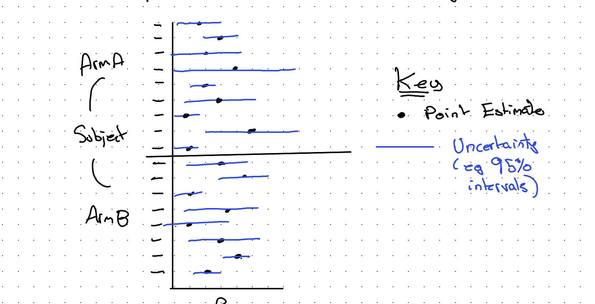

We could even use other techniques from meta analysis, like weighting points by the inverse of variance (meaning the wider the blue lines, the smaller the weight) to get a pooled estimate for each arm, and then try to compare the two pooled point estimates and their respective pooled uncertainty.

::: {style="color: #2e8b57;"}
**Note:** By convention, pooled estimates are represented as diamonds:
:::

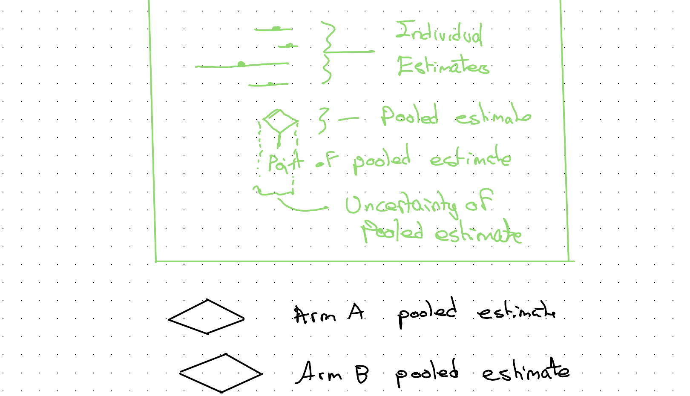

However, although this approach is maybe interesting to think about (not least as it effectively treats each subject as a separate n-of-1 'study') it's not something I've seen before, and it's almost certainly not a particularly good approach for all kinds of reasons. I've mainly just mentioned it to help with the intuition some more...

### Back on Track

So if meta-analysis isn't actually used for this kind of problem, what is?

It's something between

**One Model** AND **MANY models**

It's called multi-level modelling because we have multi-level data:

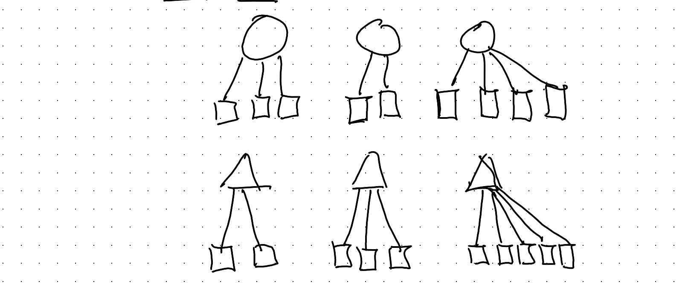

### How does it work?

Well, we need to tell the model about the way the data are grouped.

Let's go back to the fundamentals... A (generalised) linear model is:

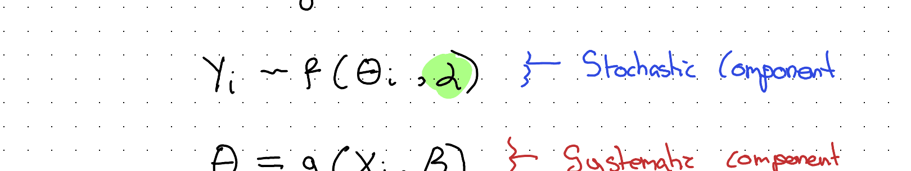

::: {style="color: #2e8b57; border: 1px solid #2e8b57; border-radius: 4px; padding: 0.5em 1em;"}
**Note:** This is a very generalised & abstracted notation. The $\alpha$ & $\beta$ here mean something different to the $\alpha$ & $\beta$ used elsewhere in this post.
:::

This is what I've called before the Grandmother Model, a general framework for thinking about what statistical models contain. In a previous post I referred to $g(.)$ as a TRANSFORMER, and $f(.)$ as a NOISEMAKER, and drew them as follows:

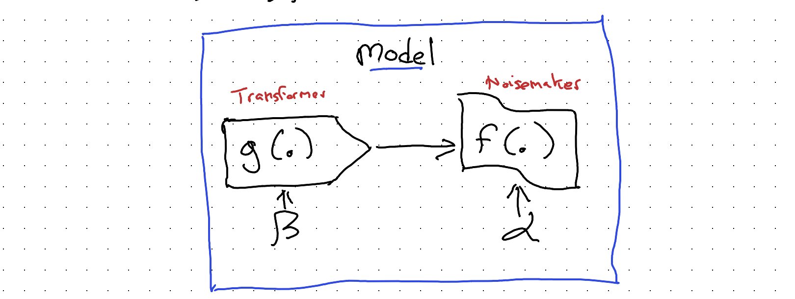

So, we have two places where we can 'tell' our model about how our observations are grouped into subjects: we can either tell the transformer $g(.)$, or we can tell the noisemaker $f(.)$. Which of the two components we tell affects what the model tends to be called:

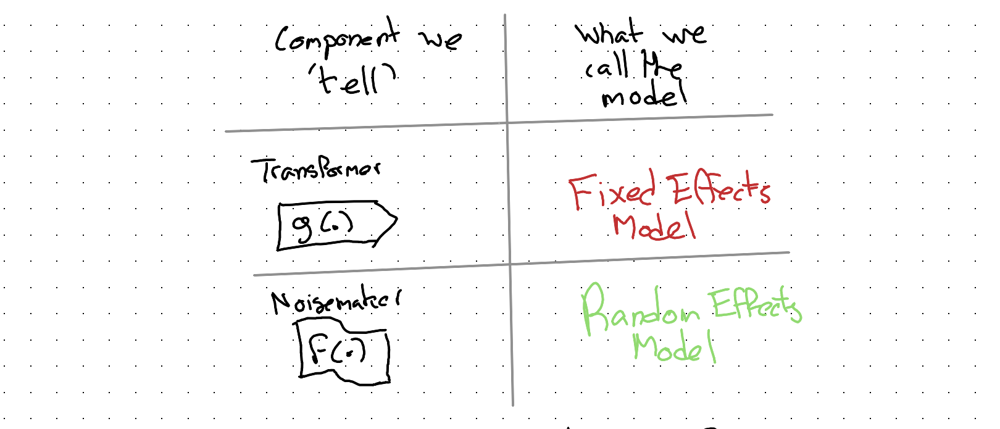

And both of these types of model can be referred to as either [**Mixed Effects Models**]{style="color: #9955bb;"} or [**Multi-level Models**]{style="color: #9955bb;"}.

If you've ever encountered these terms and haven't been sure what they mean, then hopefully this clarifies a few things.

Let's now think through how we could 'tell' our model about group-level membership of observations, first through the transformer, $g(.)$, leading to a fixed effects model specification, then through the noisemaker, $f(.)$, leading to a random effects model.

### Fixed Effects model approach

Let's say we have J groups. We could include, in our model, J additional dummy variables, each of which takes the value 1 if the observation comes from group j, 0 otherwise.

In doing this, we're expanding the intercept part of our model, potentially a lot:

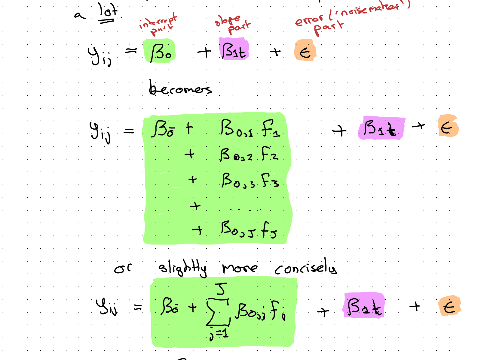

(where $F_j$ indicates a Flag variable which is 1 if obs is in group j; 0 otherwise.)

This fixed effects modelling approach is less exotic than it might first appear. We're just adding some more $\beta$ coefficients to the transformer part of the model $g(.)$ to be determined through the usual approaches (maximum likelihood, optimisation and so on).

However, with this approach we're potentially adding a lot of additional coefficients to our model, and if there are a lot of groups, each of which might only contain a handful of observations, this approach might be unnecessarily complicated and 'gluttonous', munching its way through our finite data budget in a very inefficient way that leaves little resource left to help improve the fit on the coefficients we actually care about (those on the slope and slope-difference-by-arm part of the model).

::: {style="color: #c0392b; border: 1px solid #c0392b; border-radius: 4px; padding: 0.5em 1em;"}
**A mildly barbed aside:** This kind of resource-munching and often-inefficient modelling approach seems surprisingly popular with economists and econometricians...
:::

So, is there a more efficient way of 'telling' a model about group differences, especially when there are many groups, many of which involve few observations? Yes there is! It's the...

### Random Effects Model Specification

In the Random Effects (RE) model specification, we 'tell' the noisemaker ($f(.)$), not the transformer ($g(.)$), part of the model about the 'groupiness' of the data.

So, in RE, the 'action' is in the bit of the specification highlighted orange at the end:

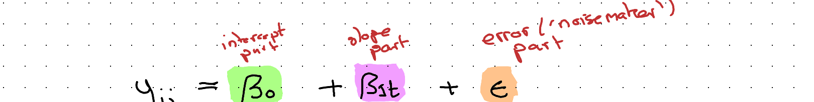

As with the FE model, we can imagine 'splitting' a component of the above into two or more subcomponents. In this case it's the orange component $\epsilon$:

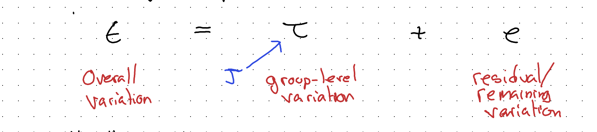

Usually, both $\tau$ & $e$ are draws from a Normal distribution:

$$\tau \sim N(., \theta_J)$$

$$e \sim N(., \theta)$$

Say at $t=0$ there are 8 groups ($J=8$), and the starting values for each group look as follows:

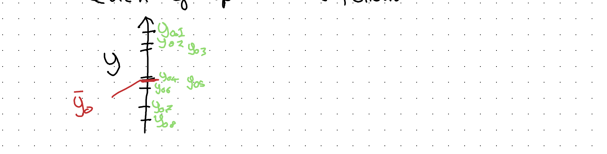

In a FE model there are 8 flags which indicate how much to shift up or down from the overall intercept $\bar{y}_0$:

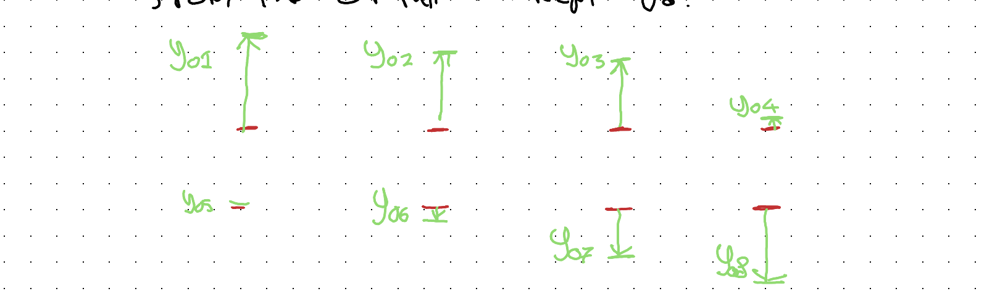

In an RE model all of this group level variation is simplified and stylised as draws from a single Normal distribution:

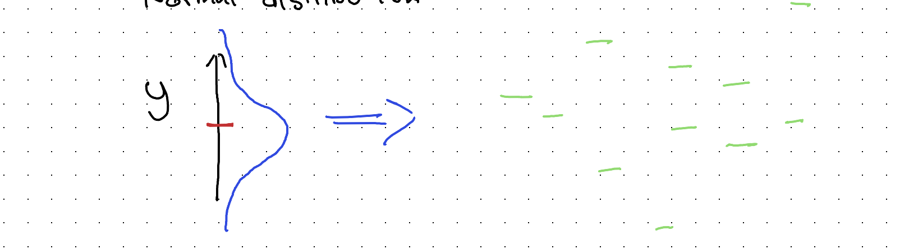

So, the aim of this approach is to represent the 'gist' of the observed group-level variation in fewer parameters. This means less of the data budget is 'spent' on representing group level variation, and so more of the budget can be spent on better estimating other model parameters instead.

### Modelling what we're actually interested in modelling

After all this discussion about how to represent group level variation, it's important not to lose sight of what we're trying to do, namely: see if Supp B has a higher weight gain trend than Supp A.

We're now used to the idea of splitting out the components of a regression model, as they relate to intercepts, slopes, and 'errors', and the way we need to do that one more time to get a model containing coefficients that can help us answer our main research question.

Let's draw out our RE model spec again, but slightly differently:

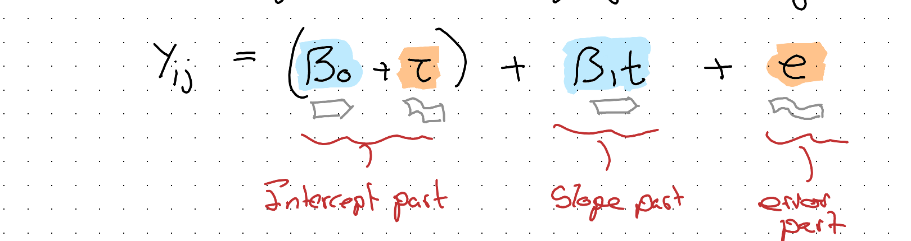

Here I've grouped the intercept part into a systematic component ($\beta_0$) and a stochastic component ($\tau$), where $\tau \sim N(0, \sigma_J^2)$. The model's exactly the same, it's just rearranged.

The purpose of this rearrangement is to make it easier to see what component to focus on, and 'split', in order to answer the research question about whether the two supplements have different weight change trajectories. As we're interested in trajectories we know the component to target is the slope; more specifically $\beta_1$:

$$\beta_1 \rightarrow \bar{\beta_1} + \beta_{1B}$$

$$\text{where } \beta_{1B} = \begin{cases} 1 & \text{iff } Supp = B \\ 0 & \text{otherwise} \end{cases}$$

Substituting:

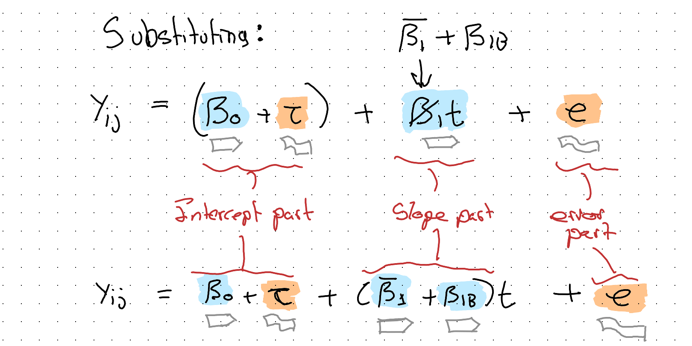

Which will be our final model specification.

### 'Testing' and interpreting the model

One easy test we can perform is by comparing the above specification, including a coefficient that flags arm B, with a restricted model that omits this term:

$$M_{Full}: \quad Y_{ij} = \beta_0 + \tau + (\bar{\beta_1} + \beta_{1B})t + e$$

$$M_{Rest}: \quad Y_{ij} = \beta_0 + \tau + \beta_1 t + e$$

We can compare the two models in a number of ways: if both are fit with Maximum Likelihood (ML) estimation, we can perform an F-test, looking for a statistically significant p-value.

If this fails, we can still make use of measures like AIC or BIC, where by convention we 'prefer' the model with the lowest score.

Implicitly, the t-value on the coefficient $\beta_{1B}$ tests for something akin to this model comparison. If the p-value associated with the t test on this coefficient is below 0.05 that's reasonable evidence of there being a real difference in slope between arms.

In R, there are a number of packages and functions that can run the above model. As an example, using the `lmer` function in the `lme4` package we could write something like:

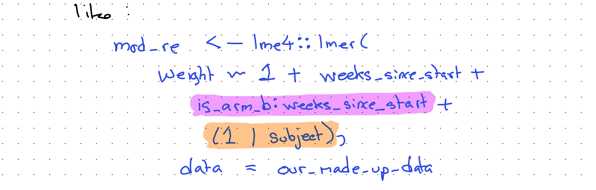

Our main coefficient of interest is the term highlighted [purple]{style="background-color: #f0b3f0; color: #000;"}, and our random intercepts component is highlighted [orange]{style="background-color: #ffd9a3; color: #000;"}.

Using the `summary()` function, summaries of both the fixed effects and random effects components will be returned.

### Discussion

In this long excursion through grouped data analysis, we've focused on a very fictitious and unrealistic example: how best to make *people* fat.

However, if we change the species and context even this example is probably useful in practice. Imagine we work in farming, for example, and have bought a lot of baby chickens or cows, and want to decide on a type of feed to help them 'grow' the fastest.

Often the animals ('livestock') will be quite homogeneous, from the same genetic stock and often even of the same sex. This kind of modelling approach would probably work for figuring out what type of feed to use in a way that's both fairly robust and fairly cheap. (Though as a vegetarian, I'd rather have come up with a different real world application of this kind of model!)

Even if this specific model specification isn't useful for you, hopefully the broader processes and steps covered — thinking about the data, the questions we want to ask of it and so on — is helpful for trying to 'operationalise' other data analysis challenges too!

---

### Claude's reflection on this transcription

*This section is written by Claude (Fable 5), reflecting on this second transcription attempt and on what changed since the first.*

The February 2026 attempt by Opus 4.6 ended its reflection by proposing exactly this experiment: revisit the same source image with a newer model and see how the accuracy changes. Five months later, the answer is: substantially — and on two distinct axes.

**Axis one: reading the words.** The 73,475-pixel scan was sliced into 27 overlapping segments at native resolution, and every segment read against the earlier transcription. Around twenty errors in the first attempt were identified, falling into recognisable failure modes:

- **Plausible substitution**: "consider *sex* as a control variable" had become "age" (the worked dataset has a Sex column and no Age column); "an *F-test*" had become "Likelihood Ratio Tests"; "a separate *n-of-1* 'study'" had become "n=2". Each substitute is the kind of thing a statistician plausibly *would* write — which is what makes this failure mode dangerous.
- **Silent omission**: the AIC/BIC fallback sentence, the $M_{Full}$/$M_{Rest}$ nested-model equations, the "An 'Interesting' Detour" heading, and the Grandmother Model passage were all simply absent.
- **Invention**: the closing sentence of the testing section did not exist in the source. (The first attempt's reflection candidly reported a larger hallucination it had already caught — a fabricated paragraph about Satterthwaite approximations — so this smaller residual invention fits the pattern it described.)
- **Word-level drift**: "Subject-Dates" → "Subject-Time", "facets" → "panels", "used" → "good", swapped symbols in the variance decomposition, and similar.

**Axis two: demarcating the canvas.** This was the deeper limitation of the first attempt, and Jon's framing of it is exact: the problem "wasn't just the transcription of text; it was also the demarcation of which portions of the canvas relate to images, tables, glyphs and figures." The first attempt's 21 crops were segmentations of convenience — several swallowed multiple paragraphs of body prose into "figure" images (its `img_09`, for instance, contained five paragraphs of flowing text alongside the diagrams it was named for), one caption described contents its image didn't have, and hand-written equations transcribable as mathematics were left as pixels.

For this attempt the canvas was re-segmented from the source: a team of Claude Opus 5 agents each swept a range of slices and classified every non-prose entity — figure, table, plain equation, annotated equation, code, coloured note-box, coloured prose — with tight pixel boundaries. Reconciling their maps against Fable 5's own reading produced the 27 fresh crops used above, cut to hug the graphical content. The consequences for the reader:

- **Prose is text.** Every flowing paragraph, including those the first attempt left inside images, is now selectable, searchable, quotable text.
- **Plain equations are mathematics.** M1–M5, the variance-decomposition distributions, the slope split, and the full/restricted model pair are rendered as LaTeX. Only equations whose *annotations* carry meaning — highlighter boxes, coloured labels, glyph arrows — remain as images, because there the drawing is the content.
- **Boxed notes are callouts.** The green F-test note, the green notation caveat, and the red "mildly barbed aside" are styled text blocks in their original colours, not screenshots of handwriting.
- **Figures are figures.** What remains as image — sketches, plots, diagrams, tables, glyphs, annotated equations, highlighted code — is there because it is genuinely graphical, and each crop now contains that entity and little else.

**The benchmark point.** This post and [its predecessor](../repeated-measures-transcribed/index.qmd) now form a two-point series against a fixed, unchanging source document. The first attempt rated itself 60–70% successful and identified raw pixel-reading as its bottleneck. This attempt found the source fully legible, and found the harder residual problem to be segmentation judgement — decisions about what *kind* of content each region is. If a future model repeats the exercise, the interesting questions will be whether it catches reading errors this pass missed, and whether it would carve the canvas differently again.
