## About this post

This post is an AI-assisted transcription of [the original handwritten notes on repeated measures](../repeated-measures/index.qmd), written on a reMarkable tablet as a single ultra-long page. The original handwritten version remains available in full, but at over 73,000 pixels tall it can be difficult to read on screen.

This transcription was produced by Claude, using an iterative image-slicing approach to parse the handwriting. The hand-drawn diagrams, annotated equations, and coloured illustrations are preserved as images from the original — they are a key part of the explanation and lose their character if converted to plain text. The surrounding narrative text and R code examples have been transcribed into readable markdown.

Where colour was used in the original handwriting, this is noted. The colour scheme is: **black** for main text, **green** for detailed discussion and answers, **blue** for diagram labels, **red** for diagram elements and emphasis, **orange** for highlighted equation components, and **purple/pink** for specific highlighted terms.

---

## Repeated Measures

Apropos of nothing specifically, I've been thinking a lot recently about repeated measures data, and how such data should be modelled.

### Our (Fictitious) Problem

Say we're interested in knowing how one of two possible supplements aids with weight gain. (This may be a science-fiction-like example given the current obesogenic environment we're in, but go with me for now), and we're interested in these two supplements' effects in the real world, not just in mice bred to be, effectively, like clones.

Because of this, we have some variety in initial shapes and sizes of our population:

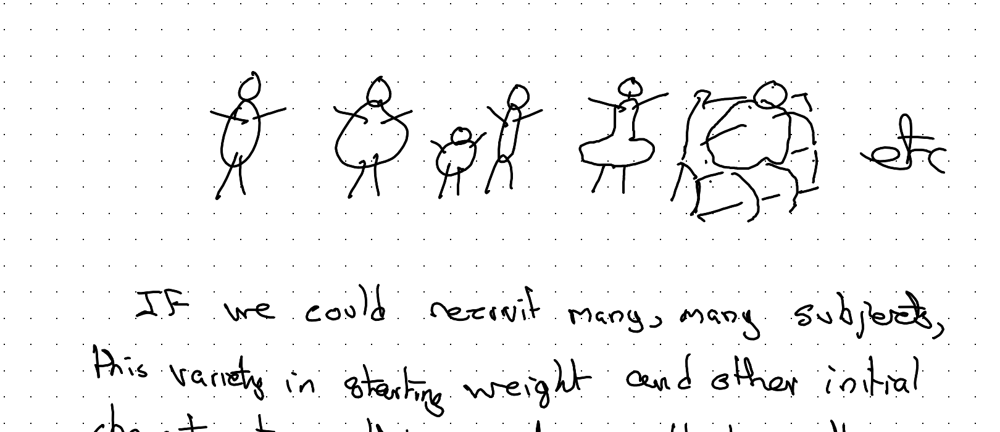

If we could recruit many, many subjects, this variety in starting weight and other initial characteristics, this variety wouldn't matter too much. We can randomise subjects to Sup A or Sup B, and through the miracles of the randomisation process on average the starting characteristics of subjects in the two arms will be the same.

However, our budget is finite, and can only stretch to tens, not hundreds or thousands, of subjects in each arm.

And, all subjects have a weight at the start, before we treat them with Sup A or Sup B.

Obviously, the subjects' starting weight can't be attributed to Sup A or Sup B. It's what they came with. So any claims about the weight adding effects of the supplements can only be based on how the weights of subjects changes over the course of the study.

One good thing about the study, however, is that each subject's weight is measured multiple times over the course of the study, not just the first and end.

### Understanding the Data

With our data and problem described, let's now start to think about what the data we're working with might look like, and how to better visualise and understand it.

We can start by imagining how the data might come to us, or what it might look like after some data cleaning and reshaping.

As I've discussed before, almost all data we can model comprises some big rectangle of numbers and values $D$, with:

i) one row per observation
ii) one column per variable

(This is the definition, in brief, of Tidy Data)

So, the first few rows of our data might look something like this:

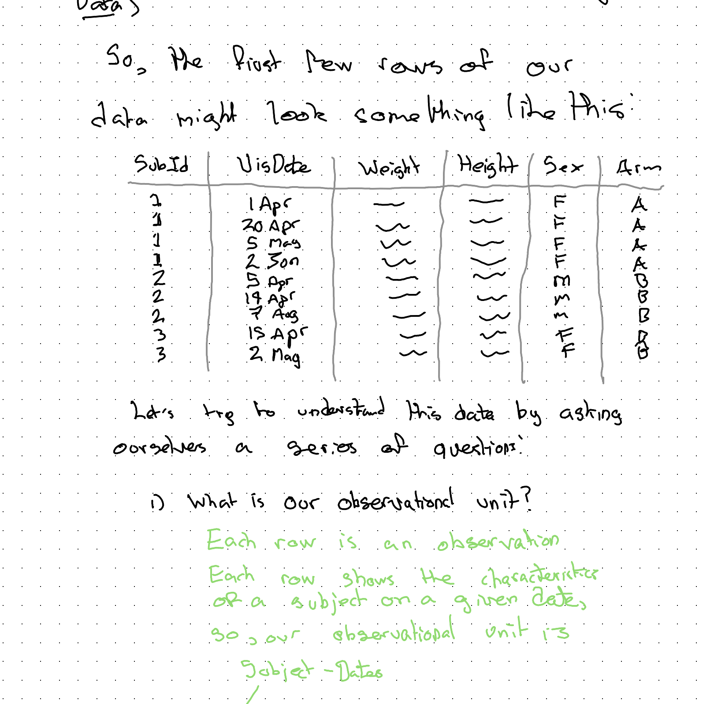

Let's try to understand this data by asking ourselves a series of questions:

#### 1) What is our observational unit?

*[Green text in original]*

Each row is an observation. Each row shows the characteristics of a given subject at a given point in time. So our observational unit is: Subject-Time.

More abstractly, we can say each row is about a time × person.

#### 2) What is our treatment variable, T?

*[Green text in original]*

This is the variable for Arm. Something like:

- A = Sup A
- B = Sup B

(So, we'll need some way of comparing changes in response for people in Arm B compared with Arm A)

#### 3) What is our response variable (Y)?

*[Green text in original]*

This definitely *involves* the weight column, but it might not *just* be the weight column.

Firstly, we know it needs to involve *change* in weight, because each subject had some weight at the start, that we know can't be caused by the supplement, which they only started taking at the start of the trial.

Secondly, we might want to account for the *height* as part of outcome/response, as someone who's taller can probably change weight more easily than someone who's shorter. (Something to ponder...)

#### 4) What are our control variables (X)?

*[Green text in original]*

If we have a big enough sample then we might not need control variables. But with our small dataset we should definitely consider age as a control variable.

We might also wish to consider starting weight as a control variable, as well as maybe height.

However, given our discussion about the response variable above, we might not want to simply use height in its standard way, and instead use it as part of our derivation of the response instead.

There are also nonstandard approaches to consider for controlling for starting weight too, which come about from pondering the next question.

#### 5) Are our observations independent?

*[Green text in original]*

This question might sound like it's coming out of left field, but it's really central to how we can think about and approach modelling this kind of data.

Independent (& identically distributed) are two standard assumptions made when deriving most statistics models. If our data aren't independent then the assumptions aren't correct, and so neither will what our model estimates be.

In the case of our data, we know our data aren't independent in one very obvious and important way.

They're nested.

Specifically, our observations (each row in the dataset) are time-persons. And we know each time-person is 'nested within' a grouping variable called a person (or subject).

Graphically we can represent this grouping as follows:

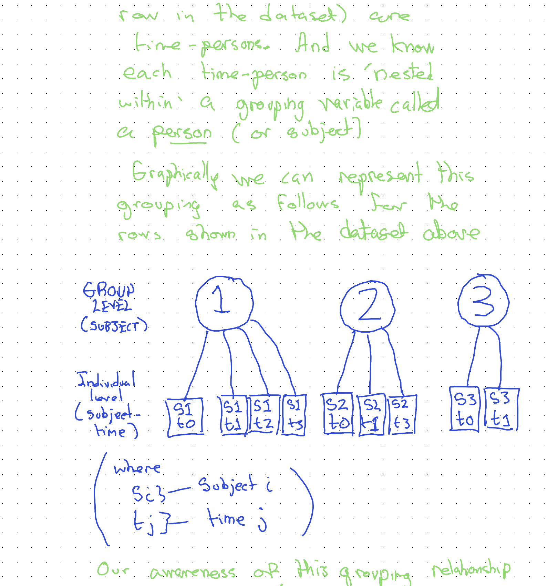

Our awareness of this grouping relationship will be critical both for how we continue to visualise the data, and for how we model the data.

### Visualising the data

Having now thought through the problem and data we have, we can start to come up with some ideas for visualising the data effectively. (Which will, in turn, help us choose an appropriate model specification.)

Two things we know:

i) Observations are grouped into subjects
ii) Earlier visits happen before later visits.

Obvious, really, but also really helpful for looking at the data the right way. A slightly less obvious thing we should have seen from the data is that subjects had their first visit on different dates (and that not all subjects had the same number of visits, nor were visits spaced out equally far apart.)

So, maybe our graphing canvas should be set up as follows:

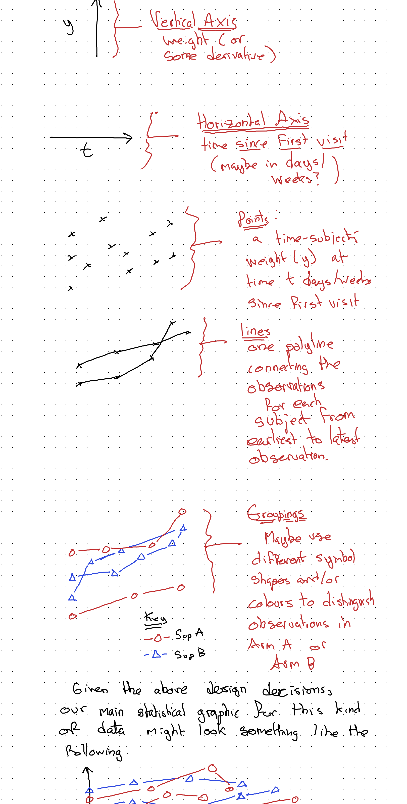

Given the above design decisions, our main statistical graphic for this kind of data might look something like the following:

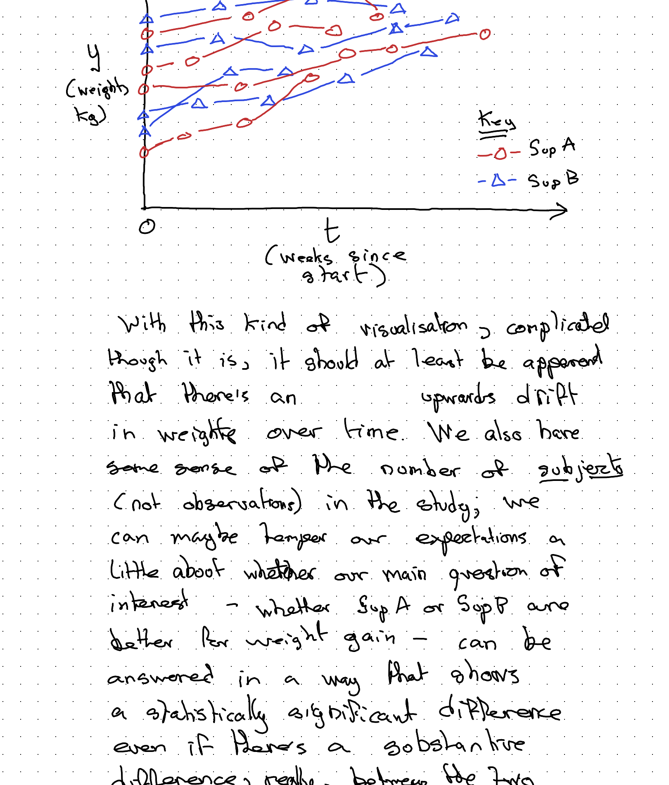

With this kind of visualisation, complicated though it is, it should at least be apparent that there's an upwards drift in weight over time. We also have some sense of the number of subjects (not observations) in the study; we can maybe temper our expectations a little about whether our main question of interest — whether Sup A or Sup B are better for weight gain — can be answered in a way that shows a statistically significant difference even if there's a substantive difference really between the two supplements. We might well be underpowered (mainly because I didn't want to spend too long drawing dots and lines!)

But we can still use this kind of visualisation, along with everything else we understand about the data and data generating process (DGP), to try to figure out the best way of modelling the data we have.

### Towards modelling

What's our simplest possible model? It's probably the mean.

Yes, the mean is a model. It's the linear regression of y (our weight response value) against the intercept:

$$M1: \quad y = \alpha + \epsilon, \qquad \epsilon \sim N(0, \sigma^2)$$

In R, something like:

```r
mod01 <- lm(weight ~ 1,
             data = data)
```

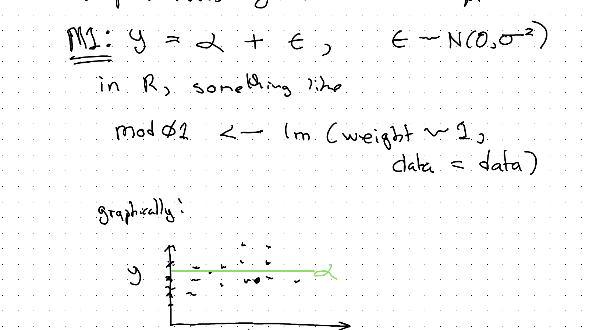

Not a very useful model. Let's try to do better, firstly by accounting for the two arms (Sup A or Sup B).

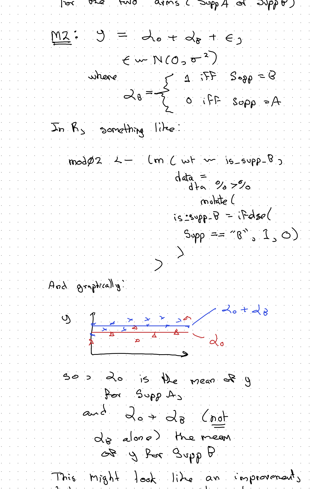

So: $\alpha_0$ is the mean of y for Supp A, and $\alpha_0 + \alpha_B$ (not $\alpha_B$ alone) the mean of y for Supp B.

This might look like an improvement, but in some ways it's not. It's a wrong turn. For instance, what would happen if Supp B really causes the most weight gain, but the average subject in the Supp A arm both tends to be heavier and to be visited more often and to exit the study earlier?

With this kind of model we might end up thinking Supp A, not Supp B, is 'better' because its model-implied mean value is higher.

In both of the models so far, we haven't yet modelled the effect of time. Let's look at that:

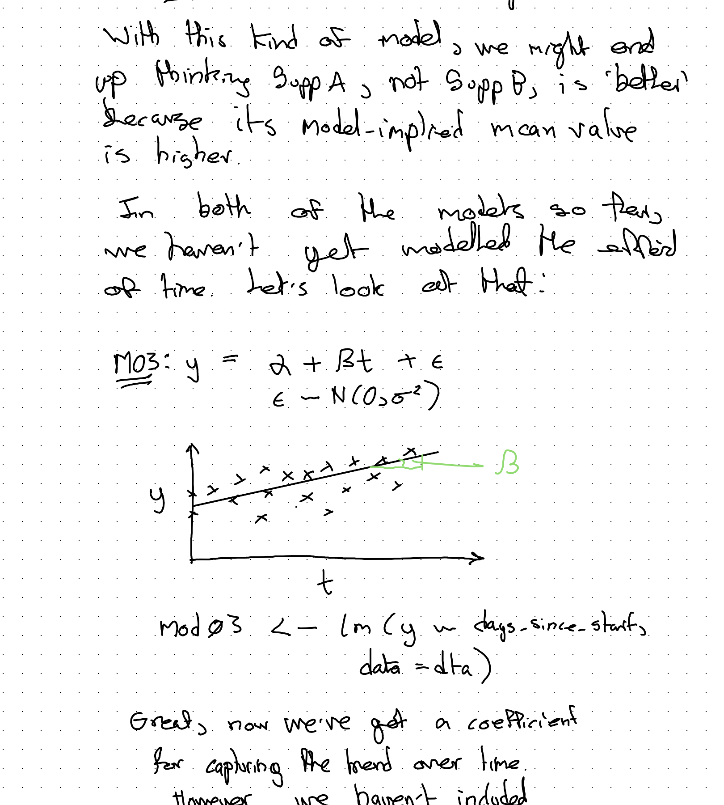

Great, now we've got a coefficient for capturing the trend over time. However, we haven't included some way of representing:

i) the subject membership of observations
ii) the difference in growth trends between supplement arms

Let's start with the second issue. One naive approach would be to include a coefficient for a flag variable, which is 1 if the arm is Sup B, but 0 otherwise.

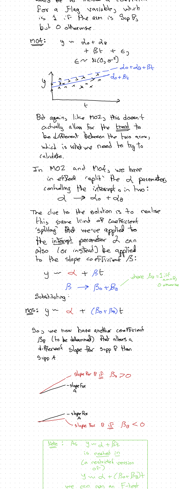

The clue to the solution is to realise this same kind of coefficient 'splitting' need never be applied to just the intercept ($\alpha$); it can also be applied to the slope coefficient $\beta$.

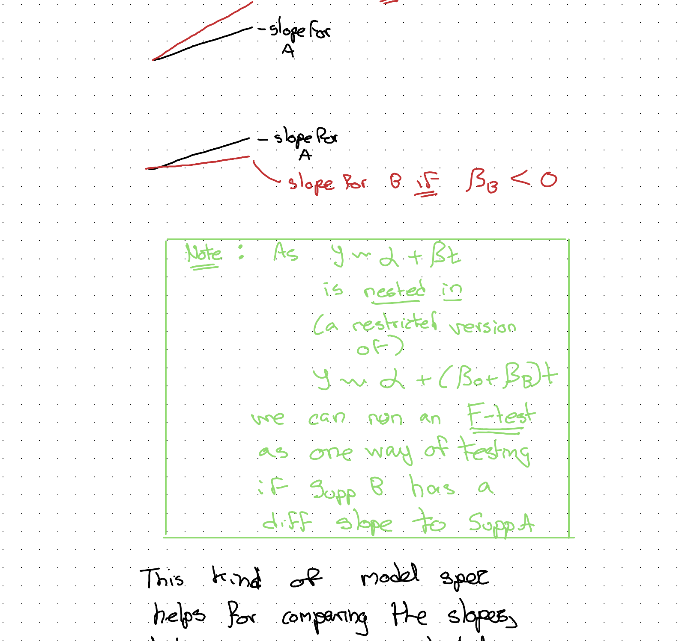

This kind of model spec helps for comparing the slopes, but now we've neglected the fact of observations being grouped in subjects. It doesn't have different groups, or different initial weights.

How do we try to account for this? Perhaps we shouldn't be thinking about one model, but

## MANY Models ??!

If we arrange the data into many panels, one for each subject, we can do a simple regression for each subject series!

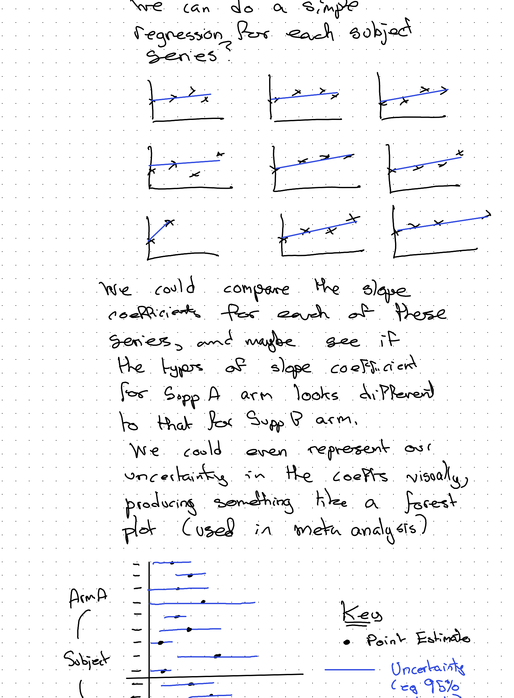

We could compare the slope coefficient for each of these series, and maybe see if the types of slope coefficient for Supp A arm looks different to that for Supp B arm.

We could even represent our uncertainty in the coefficients visually, producing something like a forest plot (used in meta analysis):

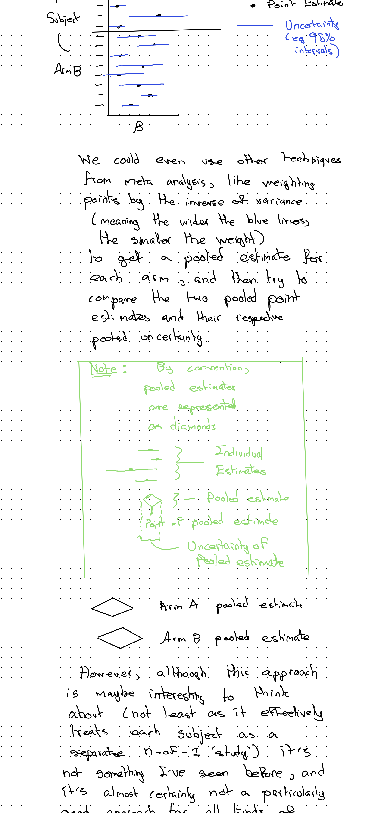

We could even use other techniques from meta analysis, like weighting points by the inverse of variance (meaning the wider the lines, the smaller the weight) to get a pooled estimate for each arm, and then try to compare the two pooled point estimates and their respective pooled uncertainty.

However, although this approach is maybe interesting to think about (not least as it effectively treats each subject as a separate n=2 'study'), this is actually not a particularly good approach for all kinds of reasons. I've merely just mentioned it to be helpful with the intuition some more.

### Back on Track

So, if meta-analysis isn't actually good for this kind of problem, what is?

It's something between **One** Model AND **MANY** Models.

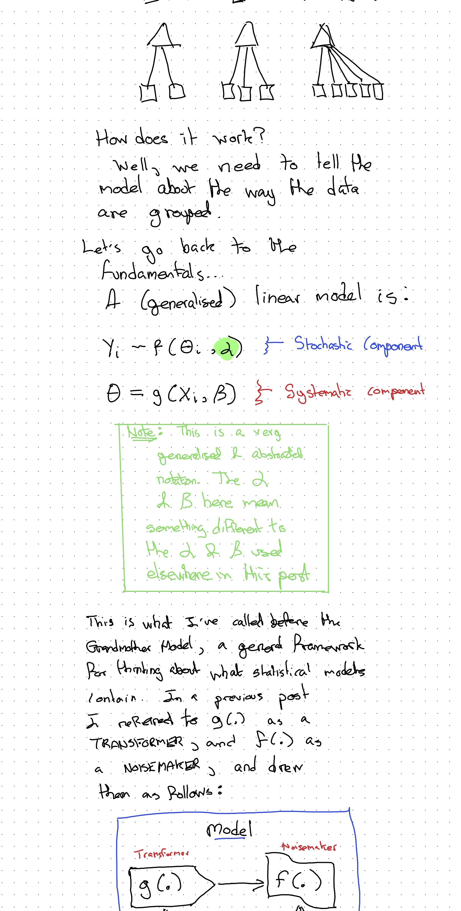

It's called multi-level modelling because we have multi-level data.

### How does it work?

Well, we need to tell the model about the way the data are grouped.

Let's go back to the fundamentals... A (generalised) linear model has a stochastic component and a systematic component. In a previous post I compared the systematic component $g(.)$ to a TRANSFORMER and the stochastic component $f(.)$ to a NOISEMAKER:

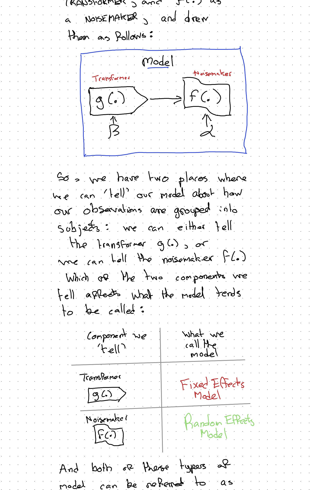

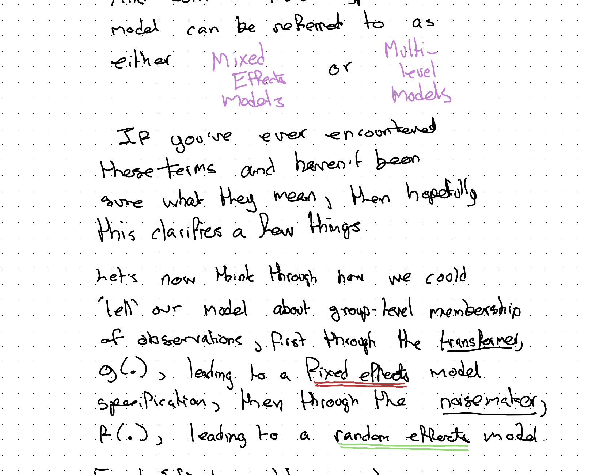

And both of those layers of model can be referred to as either **Mixed Effect** or **Multi-level Model**.

If you've ever encountered these terms and haven't been sure what they mean, then hopefully this clarifies a few things.

Let's now think through how we could 'tell' our model about group-level membership of observations, first through the transformer, $g(.)$, leading to a fixed effects model specification, then through the noisemaker, $f(.)$, leading to a random effects model.

### Fixed Effect model approach

Let's say we have J groups. We could include, in our model, J additional dummy variables, each of which takes the value 1 if the observation comes from group j, 0 otherwise.

In doing this, we're expanding the intercept part of our model, potentially a lot:

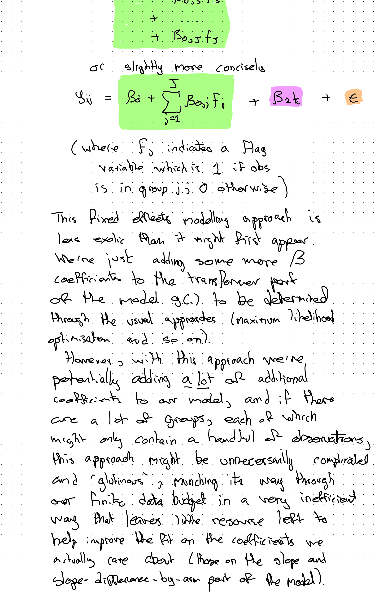

This fixed effects modelling approach is less exotic than it might first appear. We're just adding some more $\beta$ coefficients to the transformer part of the model $g(.)$ to be determined through the usual approaches (maximum likelihood, optimisation and so on).

However, with this approach we're potentially adding a lot of additional coefficients to our model, and if there are a lot of groups, each of which might only contain a handful of observations, this approach might be unnecessarily complicated and 'gluttonous', munching its way through our finite data budget in a very inefficient way that leaves little resource left to help improve the fit on the coefficients we actually care about (those on the slope and slope differences, by-arm part of the model).

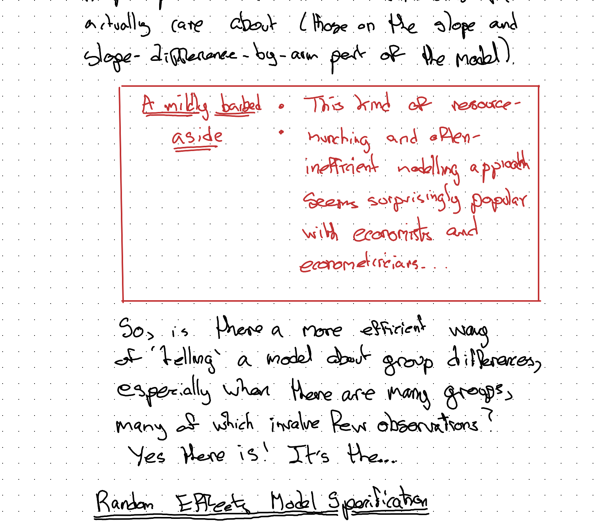

So, is there a more efficient way of 'telling' a model about group differences, especially when there are many groups, many of which involve few observations? Yes there is! It's the...

### Random Effects Model Specification

In the Random Effects (RE) model specification, we 'tell' the noisemaker ($f(.)$), not the transformer ($g(.)$), part of the model about the 'groupiness' of the data.

So, in RE, the 'action' is in the bit of the specification highlighted orange at the end:

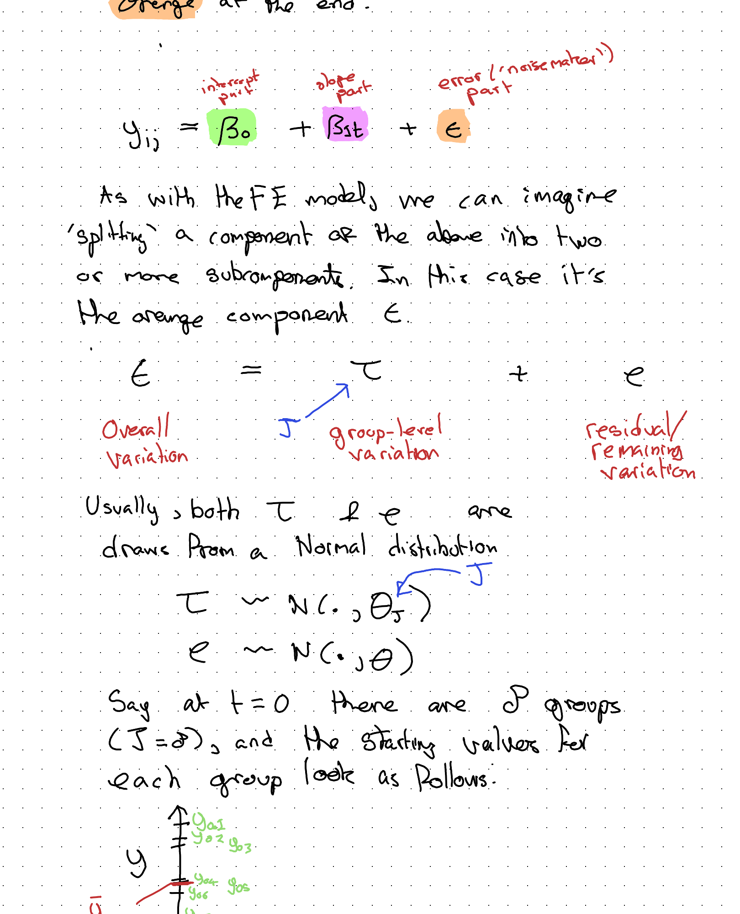

Overall variation = group-level variation ($\tau$) + residual/remaining variation ($\epsilon$)

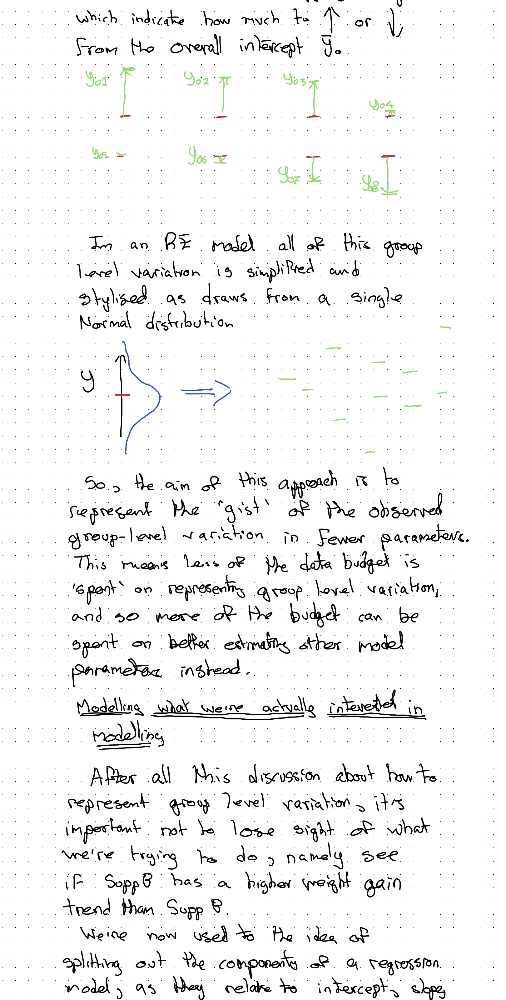

So, the aim of this approach is to represent the 'gist' of the observed group-level variation in fewer parameters. This means less of the data budget is 'spent' on representing group level variation, and so more of the budget can be spent on better estimating other model parameters instead.

### Modelling what we're actually interested in modelling

After all this discussion about how to represent group level variation, it's important not to lose sight of what we're trying to do, namely: see if Supp B has a higher weight gain trend than Supp A.

We're now used to the idea of splitting out the components of a regression model, as they relate to intercepts, slopes, and 'errors', and the way we need to do that one more time to get a model containing coefficients that can help us answer our main research question.

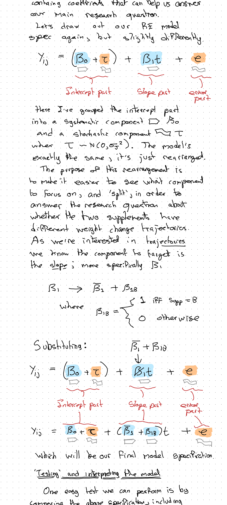

Which will be our final model specification.

### Testing and interpreting the model

One easy test we can perform is by comparing the above specification, including a coefficient that flags arm $\beta_{Bs}$, with a restricted model that omits this term. We can compare the two models in a number of ways: if both are fit with Maximum Likelihood (ML) estimation, we can perform Likelihood Ratio Tests, looking for statistically significant p-values.

Arguably, the t-value on the coefficient $\beta_{Bs}$ for testing should also be equivalent (so it might be easier to just look at that instead). But remember: evidence of there being two different slopes between groups is a good reason to understand/explore what these differences in slope between groups really mean.

In R, there are a number of packages for fitting this kind of model:

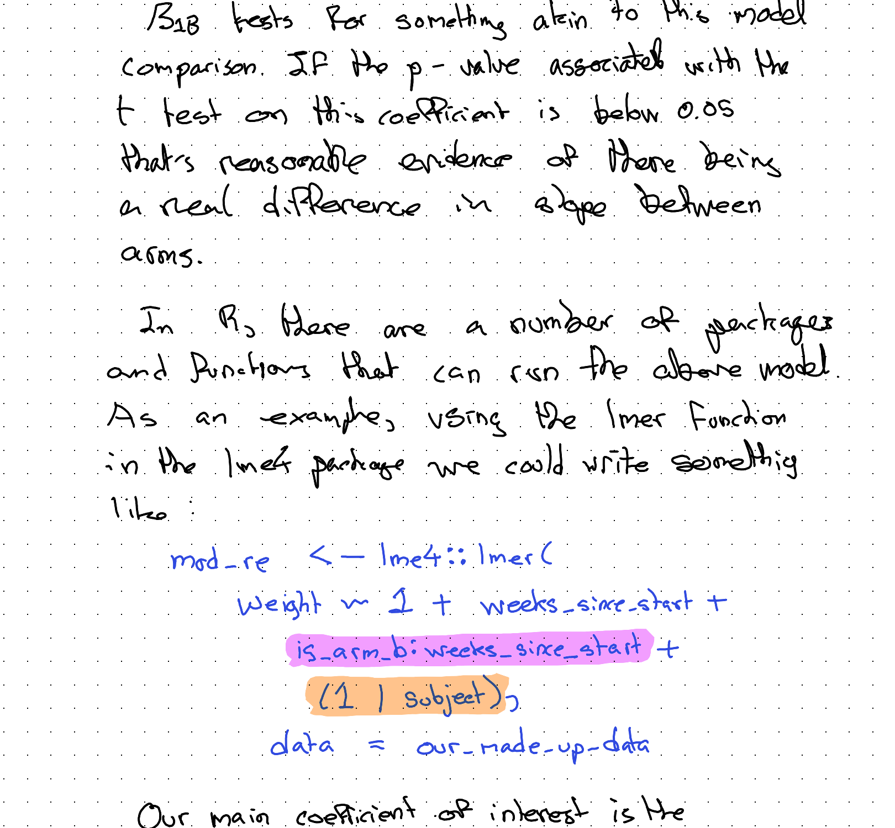

Using the `summary` function, both the fixed effects and random components will be returned.

### Discussion

In this long excursion through grouped data analysis, we've focused on a very fictitious and unrealistic example: how to best make *people* fat.

However, if we change the species and context even this example is probably useful in practice. Imagine we work in farming, for example, and have bought a lot of baby chickens or cows, and want to decide on a type of feed to help them 'grow' the fastest.

Often the animals ('livestock') will be quite homogeneous, from the same genetic stock and often even of the same sex. This kind of modelling approach would probably work for figuring out what type of feed to use in a way that's both fairly robust and fairly cheap. (Though as a vegetarian, I'd rather have come up with a different real world application of this kind of model!)

Even if this specific model specification isn't useful for you, hopefully the broader process and steps covered — thinking about the data, the questions we want to ask of it and so on — is helpful for trying to 'operationalise' other data analysis challenges too!

---

### Claude's reflection on this transcription

*This section is written by Claude (Opus 4.6), reflecting on the process and quality of this transcription.*

Jon rates this transcription as roughly 60-70% successful, which I think is fair. It was an interesting experiment that revealed both possibilities and clear limitations.

**What worked reasonably well:**

- The iterative "shingling" approach — slicing the 73,000-pixel image into overlapping segments, borrowing the concept from R's `lattice` package — was effective for turning an otherwise impossibly large image into manageable chunks.
- The earlier, more narrative sections of the notes were transcribed with reasonable accuracy. Larger handwriting and standard prose are within my comfort zone.
- Identifying the overall structure, section boundaries, and colour usage was straightforward even at low resolution.

**What didn't work well:**

- I hallucinated content towards the end of the document, fabricating an entire paragraph about Satterthwaite's approximation and Kenward-Roger adjustments that appeared nowhere in the original notes. This is a serious failure mode — confidently generating plausible-sounding technical content that the author never wrote. The final slice was the tallest (5,748px), pushing the limits of readable resolution, and rather than flagging uncertainty I filled in gaps with invention.
- Several phrases were misread: "a mildly barbed aside" became "entity model aside"; "height as part of outcome/response" became "home/regime"; "need never" became "can never". These aren't catastrophic individually, but they accumulate.
- Dense handwriting, especially where equations, annotations, and colour overlap, remained challenging. Many of the annotated equations had to be preserved as images rather than transcribed, which is the right call but also an honest acknowledgement of the limitation.

**The broader point:**

Claude models are currently less multimodal than some alternatives when it comes to this kind of image parsing task. Google's Gemini models, with their heritage in OCR (Google Lens, Cloud Vision) and their ability to ingest very high-resolution images natively, likely have a comparative advantage for raw handwriting extraction. The bottleneck here wasn't reasoning about the content — it was reliably reading the pixels.

This remains a genuinely hard problem. Handwriting recognition on structured technical content (mixing prose, equations, diagrams, code, and colour) is at the frontier of what current multimodal models can do. The shingling workaround helped, but it's a workaround — not a solution to the underlying resolution and parsing constraints.

If nothing else, this experiment provides a useful baseline. As multimodal capabilities improve, it would be interesting to revisit this same source image and see how the accuracy changes.
