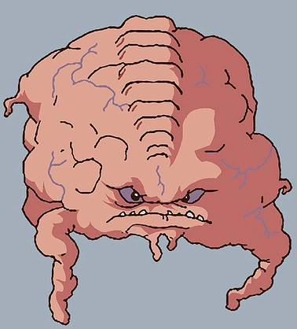
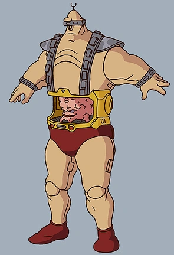
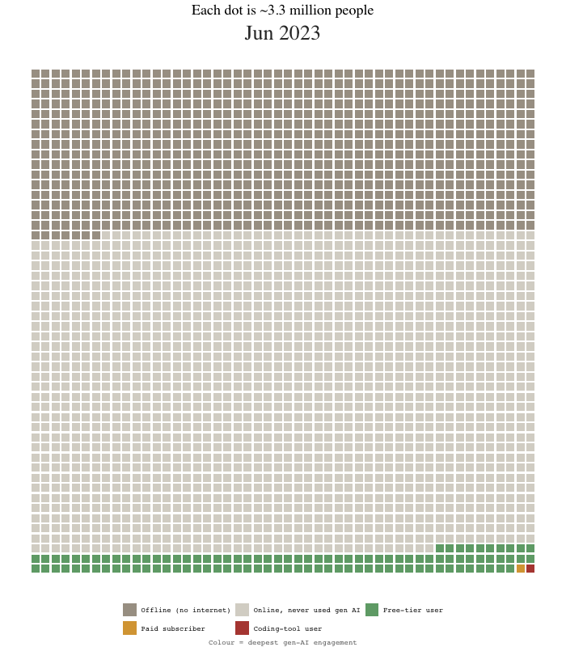
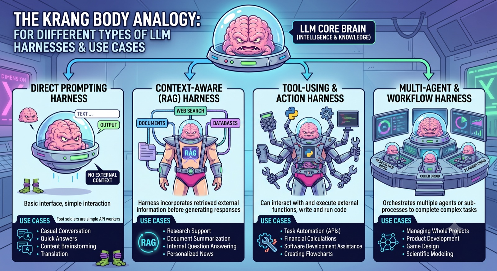

One of the most impactful charts on AI adoption from earlier this year is this waffle chart from Damian Player, back in Feb 2026.

.](player-original-waffle.jpeg){fig-alt="Waffle chart of 2,500 dots titled 'Each dot is ~3.2 million people'. A vast grey field labelled 'Never used AI (84%)', a green band of free chatbot users (16%), a short row of yellow dots for those paying $20 a month, and a single red dot labelled 'Uses coding scaffold'."}

Note the colours of the squares, with only a single solitary square coloured red, implying use of an LLM within a Code Scaffold.

To me there's a world of difference between LLMs in code scaffolds (the red square) and even the relatively sophisticated, paid-for LLMs represented by the orange squares. In many ways the gap in effective capability between the red square and the orange squares is even bigger than that between the 'premium' LLMs of the orange squares and the free tier LLMs of the green squares.

The quickest way to explain the difference between the orange square and the red square is with this very silly pop culture icon: Krang from Teenage Mutant Ninja Turtles:

::: {layout-ncol=2}
{fig-alt="Krang from the 1987 Teenage Mutant Ninja Turtles cartoon: a scowling pink brain-like alien with small eyes, a wide toothy grimace, and stumpy tentacle arms, with no body."}

{fig-alt="Krang's android body from the 1987 cartoon: a large hulking humanoid robot, with Krang the pink brain creature visible inside a cavity in its stomach."}
:::

So, Krang has a (is a?) pink blobby brain, inside a big hulking robot body.

You can see that Krang-as-blob *does* have some limited means of interacting with and perceiving the world: eyes, ears, stumpy little pink hands. In theory speaking and listening alone provide some means of influencing the world (for good or, in Krang's case, evil),[^1] and the stumpy pink hands *could* in theory carry, make and craft things in their own right. But with these capabilities alone, what Krang-as-blob can do is pretty limited, despite the high reasoning capabilities attributed to him (as the villainous mastermind in the show).

[^1]: I really hope the analogy doesn't hold *too well*, and modern frontier LLMs aren't, like Krang, evil megalomaniacs, as then we have a very severe *alignment problem*...

Krang-as-blob is an *orange square* on the adoption wafflechart. A premium reasoning LLM, who listens and thinks and plans and responds, but in practice can't alone do much more.

The robot body is the *code scaffold*. On its own, the robot body is inert. And on its own, Krang-as-blob is, if not exactly benign, severely rate limited.

But put Krang-as-blob into the robot body, and suddenly Krang's affordances and capabilities multiply many times over. Krang, as in Krang-as-blob-and-body, can't just advise and implore others to do his (nefarious) bidding, but do work himself.

That's the difference between the red square and the orange squares, and why that difference really matters.

## Coda

When I passed a screenshot of Player's famous wafflechart to Claude Fable a few weeks ago, it wasn't just able to identify the source, but also find the underlying data, make reasonable corrections to some of the assumptions and sources used, and find data covering adoption over time, both correcting the chart as of Feb 2026, and allowing change in the adoption picture to be represented over time using a motion chart, shown below.

{fig-alt="Animated waffle chart of 2,500 dots, each representing roughly 3.3 million people, coloured by deepest generative AI engagement. Green (free-tier), amber (paid) and red (coding-tool) bands advance up the grid between mid-2023 and early 2026."}

The tl;dr: the share of LLM use in code scaffolds as of Feb 2026 was likely an under-estimate, but not by much in absolute terms. There were *red squares* at the time, not a solitary *red square*. Exposure has increased over time too. But qualitatively, then and now, the key distinction, and relative exposure to green, orange and red squares, remains broadly correct.

To see a Claude Fable-authored technical post on its production of the animated wafflechart, [click here](../ai-adoption-chart-rebuilt/index.qmd).

## Addendum: Gemini's extension

Google's Gemini Pro, given the Krang analogy, produced the infographic below - extending the blob/body distinction of this post into a four-tier taxonomy of harnesses: bare brain, RAG exoskeleton, tool-using body, and a whole mission control of specialised Krang droids.

{fig-alt="Cartoon infographic titled 'The Krang Body Analogy: for different types of LLM harnesses and use cases'. A Krang-like brain labelled 'LLM core brain' feeds four panels: a Direct Prompting Harness (brain alone in a hover-bubble, no external context), a Context-Aware RAG Harness (brain in an exoskeleton wired to documents, web search and databases), a Tool-Using and Action Harness (brain in a multi-armed robot holding tools, code and a calculator), and a Multi-Agent and Workflow Harness (several small Krang droids operating a mission-control console). Each panel lists example use cases."}
