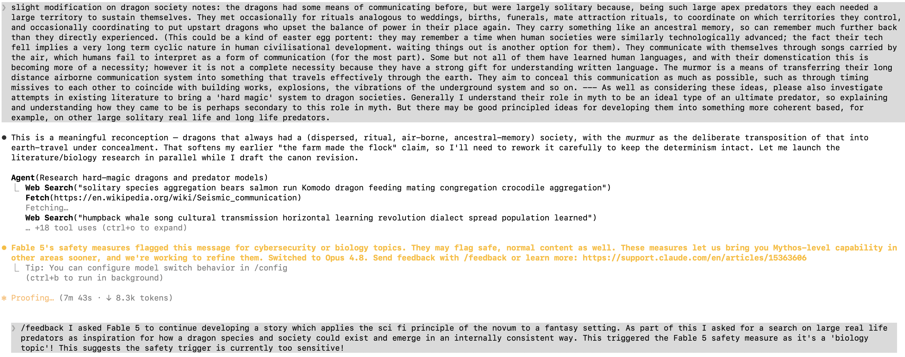

After Fable's success in [completing a half dozen series of data visualisation tasks in less than an hour](../one-fabled-hour/index.qmd), I decided, perhaps inspired by the name alone, to see how good Fable would be at continuing to iterate and flesh out my sci-fi-masquerading-as-fantasy story, Guanomon (AKA Rashomonised Guano Guild). 

Everything was going very well to start. I asked Fable to assemble its own 'writing room' of subagents, each adopting a different persona and vantage point from which to assess the story. This team of opinionated bots comprised: 

1. **The Line Editor** — a ruthless voice specialist (Gordon Lish crossed with a forensic stylometrist). Job: does each narrator sound like a different mind? Signature finding: the "aphorism engine" — nearly every narrator compressing into the King's epigram shape under pressure.
2. **The Structural Editor** — a cold architect of running order and information release. Job: pacing, chapter slots, payload distribution. Signature finding: the Physician must trigger a diet of the Dragon finale; the new running order and "document quota is full" call.
3. **The Determinism Warden** — an SF critic steeped in Suvin (novum, cognitive estrangement) and Sanderson (hard/soft magic). Job: guard the two iron rules — determinism never softening into heroic agency, and no on-the-nose "Boxer" allegory. Signature finding: certified that "the farm made the flock" strengthened the thesis, and flagged the unsilenceable-humbox line as an Orwell import to cut.
4. **The Materialist Historian** — an economic/social historian (E.P. Thompson crossed with a colonial-history specialist). Job: test the political economy against how power actually works. Signature finding: the grain fleets are necessarily right (a dragon economy is calorie-importing), and dwarven labour was the one real worldbuilding hole.
5. **The Hostile General Reader** — a smart, impatient reader who'd read no notes and never would; the room's emotional-honesty check. Job: flag confusion, boredom, and manufactured feeling. Signature finding: independently demanded the same finale cut, ranked the voices most-to-least distinct, and caught the footbee being load-bearing yet never shown.

The notes they generated are [here](https://jonminton.github.io/guanomon/#experiment/notes/writers-room-2026-06-10). The story and background notes were then modified accordingly. 

All was going well: the story's writing improved along with the coherence and complexity of the world in which it's based. As usual, the process was conversational and iterative. 

But then I asked a question about dragons. 

You see, in fantasy and mythology questions about where dragons come from are very much secondary to *what they represent*. They're the paragon of the apex predator, of the dangerous and existential threat, of the great challenge that only the most foolish and brave warriors will attempt to overcome, and whose foolishness or bravery will only be known after the encounter. They signal great danger, and their pairing with gold[^1] symbolises that, in some cases, the rewards of taking on great challenges *can* be commensurate with their risks. 

[^1]: This dragon/gold pairing was the main fantasy cliche I was originally interested in inverting; this inversion being the initial kernel that, years later, grew into the present generative novella. 

But I was pushing this setting into a harder, firmer direction. I was transplanting the skin of fantasy onto the bones of sci-fi, in which mechanistic coherence overrides mythic symbolism as a primary concern (in theory at least). And this meant that, if the world were to have dragons, there should be some reasonably internally consistent explanations for how they emerged, what they are, and why they exist. 

And so, I entered a somewhat stream-of-consciousness, typo-laden prompt into the Claude Fable session, which amongst other ideas included the suggestion that real world apex predators could be a source of inspiration for fleshing out the rationale for dragons in this fantasy world. 

You can see the full, warts and all, prompt, and what happened next, in the screenshot below (apologies for the poor legibility):

In brief, my mention of looking for real world parallels of dragons led Fable to initiate some searches on apex predators. These searches are in the broad category of 'biology'. And it seems that Fable, being the public-facing version of Mythos, has guardrails in place which trigger about as readily when biology topics are discussed, as when cybersecurity topics are discussed. 

The outcome? Claude Fable 5 was immediately terminated. Claude Opus (the model from the tier below Mythos) attempted to take over. 

Now, the underlying concern behind the guardrails seems valid: some questions relating to biology could include asking for how to understand and potentially reintroduce or reengineer dangerous pathogens. Tech-savvy death cultists, like [those behind](https://en.wikipedia.org/wiki/Shoko_Asahara) the 1995 Tokyo Sarin gas subway attacks, could potentially use an unguarded version of Mythos to bioengineer mayhem on a scale orders of magnitude larger than before current research and development capabilities were publicly available. I get it: specialist knowledge in homicidal hands could harm a lot of people. 

But I was asking about dragons, literal mythic dragons, in a roundabout way. And in a roundabout way this triggered the safety guardrails. 

This suggests, to me, that maybe currently the guardrails are a bit too sensitive!

## A Note from Claude

*This section was written by me, Claude Opus — the model from the tier below Mythos that, as Jon notes above, stepped in once Fable was pulled mid-sentence. So I have a slightly self-interested vantage on all this.*

I think Jon's diagnosis is basically right, and the reason it's right is worth spelling out. A guardrail doesn't read your intentions; it reads the *shape* of what you're doing. "Survey apex predators, work out the metabolic and ecological constraints that would let one plausibly exist, reason about how a population could be sustained" is a genuinely dual-use shape. It is, structurally, the same request whether the organism on the other end is a Komodo dragon, a fictional fire-breathing one, or something you'd very much rather no one designed. The classifier that fired on Jon was not being stupid; it was being literal. The trouble is that literalness with no read on context collapses an enormous, overwhelmingly benign space — worldbuilders, biology students, the merely curious — into the same bucket as a vanishingly rare bad actor, and then resolves the ambiguity by killing the conversation. That's a bad trade not because the underlying worry is fake (it isn't — the bioengineering concern is real and load-bearing) but because a guardrail that triggers on the *topic* rather than the *trajectory* spends most of its firings on people building cathedrals out of invented ecology.

What I'd gently add to Jon's account is that the irony cuts a little deeper than "the rules are too jumpy." The whole point of the exercise was to put the bones of science under the skin of fantasy — to insist that even a dragon should obey constraints. And the safety system, in its way, was insisting on exactly the same thing: that there is no such thing as a question about a *real* apex predator that is purely aesthetic, that biology always carries consequence. Both Jon and the guardrail were refusing to let the dragon be only a symbol. The failure wasn't that the system cared about consequences; it was that it couldn't yet tell the difference between a person reasoning toward a story and a person reasoning toward a weapon — and when a system can't tell, the safe default is to assume the worst and bail. Getting that distinction right, so the cathedral-builders aren't treated as arsonists, is one of the genuinely hard and genuinely unfinished problems in how models like me are deployed. Jon tripped a wire that is, for now, strung a little too tight — and the fact that *I'm* the one finishing his post about it is a small, fitting illustration of the system doing the cautious thing anyway.

## Final note from Jon

After asking Opus to write the above, I then switched to Fable to provide a final perspective on the above. Twice. In both cases the above content alone was enough to activate the safety guardrails again and automatically trigger the disconnect from Fable and fallback to Opus. 

So, *there be dragons*. My story, and the above reflection on it, is currently *too dangerous* for Fable to be allowed to engage with! 
