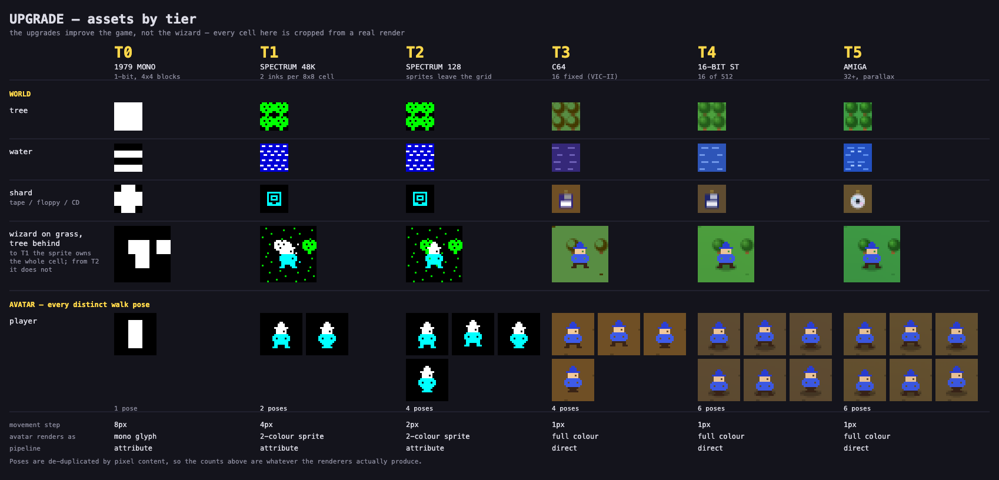
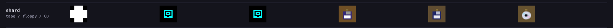
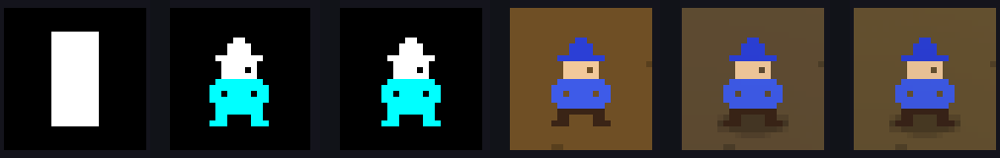

> **\[SKELETON - Claude, 2026-07-26\]** This is a first-pass scaffold built from `notes.md`. Blockquoted **\[TODO\]** lines mark work still to do. Blockquoted *\[from notes\]* blocks are your own notes ported over more or less verbatim where the level of detail suggests they need unpacking rather than paraphrasing. Draft paragraphs are written where the shape of the argument already seemed clear enough to commit to prose - treat those as proposals, not decisions. Delete this block before publishing.

## Back

Less than a week ago, I found myself stimulating my brain to produce good feelings by exposing my eyeballs to some YouTube videos showing playthroughs of ZX Spectrum games. I found myself idly engaged by [a playthrough of Robin of the Woods](https://www.youtube.com/watch?v=vGIg5z7oE4w&t=672s), a game in which the player navigates a multiscreen medieval forest, nonchalantly clubbing enemies to crumbled unconsciousness for the crime of patrolling endlessly in straight lines.

This reminded me of, to my mind, a better ZX Spectrum game, Feud, about two wizards - brothers locked in bitter rivalry - who wander around a similar forested arena of largely black screens, seeking ingredients for potions which, when deposited at cauldrons near their bases, grant them spells which, ultimately, allow them to vanquish their sibling, thereby either losing the game (if the vanquished sibling is the player), or winning the game (if the vanquished sibling is the computer-controlled rival).

As [this video essay](https://www.youtube.com/watch?v=w7U8qCLbBUo) makes clear, in practice Feud probably isn't as good as I remember. Only a minority of spells matter, meaning only a minority of ingredients matter, meaning only a minority of locations matter. And as there's only one arena, which never changes, after a few playthroughs beating the game becomes just a matter of repeating the same routes, acquiring the same ingredients, shooting fire and lightning into the rival until he, Wicked Witch of the West Style, descends into the floor, producing a single perfunctory "Victory" screen.

But the core loop - search, collect, upgrade, repeat; all while competing against a rival trying to do the same - along with the highly distinct visual 'style' of the ZX Spectrum, made me think maybe there's something worth pulling out of misremembered nostalgia and making real in the present day. And it made me think of the Home Computer systems I had during the 1980s through to mid 1990s, and how the types of game, and experience of gaming, changed with each system.

From this, the kernel of a game idea, Upgrade, was born. And with Claude Fable, in the Claude Code scaffold, it turned out this game idea was relatively straightforward to conjure into some form of existence. And then, more promisingly, to iterate upon and tune through more than a dozen rounds of playtesting and feature development.

# Up: The Upgrade Game

**Play it: [jonminton.github.io/upgrade-game](https://jonminton.github.io/upgrade-game/)** · [map editor](https://jonminton.github.io/upgrade-game/editor.html) · [source](https://github.com/JonMinton/upgrade-game)

## The core loop

The core conceit is that the upgrades don't make your character stronger. They make the *game's graphics and audio* better.

Every entity in the world - you, your rival, the environment - has a development tier. (TX, from X=0 through X=5). The tier controls only presentation: resolution, palette, colour rules, animation smoothness, sound hardware. Movement speed, attack power and health are identical at every tier. What you are racing for is not power. It is fidelity.

The loop wrapped around that conceit is Feud's, transplanted. You navigate a flick-screen arena - a British-folklore valley of village, greenwood, marsh and ruined keep - looking for shards: relics of future hardware half-buried in the landscape, a thermionic valve glowing among the reeds, a 3.5" floppy stuck in a tree like the sword in the stone. Gather three, carry them to the Standing Stones, and survive a three-second channelling ritual (longer at the final ascension stage) - interruptible, naturally, by anyone minded to shoot you mid-chant - and the whole game re-renders underneath you, one tier closer to 1995.

You are not the only one foraging. Kernagh, a rival hedge-wizard, starts at the same tier as you but on the far side of the valley, and wants exactly what you want. Combat is kept simple: one projectile, a crackling static bolt; three hits and you are derezzed - dissolved into a burst of noise pixels, dropping every shard you were carrying where you fell, respawning at your home village one tier lower than you were. And there are two ways to win: transcendence, in which you reach the top tier, gather three final shards, and complete one last, longer ritual before Kernagh does; or elimination, in which you derez him while he is already scraping along the floor at T0. Each, of course, has its mirror image, in which the wizard transcended against, or derezzed at rock bottom, is the player, and the game is thereby lost rather than won.

Although the comparative levels of the two wizards are shown in the status screen alongside the play arena, it also leaked through in the rival's aesthetics: if you're at T2 while Kernagh is at T4, for instance, then when Kernagh appears on screen he's the only entity visible to you, in the whole arena, who *doesn't* experience colour clash!

## Attribute clash, and why it existed

The Spectrum had a very distinctive graphical style, and it was a style produced entirely by a limitation. The machine let you specify pixels as 'on' or 'off' at a comparatively high resolution - but the *colours* associated with 'on' and 'off' could only be specified for 8×8 tiles of cells within that resolution.[^1]

[^1]: **Claude Footnote:** Fact-checked and confirmed. The Spectrum's bitmap is 256×192 pixels, with colour attributes stored separately for each of the 32×24 cells of 8×8 pixels: one INK (foreground) and one PAPER (background) colour per cell, drawn from an 8-colour palette, plus a per-cell BRIGHT bit and FLASH bit. One nuance to the framing in the body: the word-processor logic holds, but the primary design driver was memory economy - the whole display fits in about 6.75 KB (6,144 bytes of bitmap plus 768 of attributes), where per-pixel colour at the same resolution would have needed several times the RAM and correspondingly faster, more expensive video circuitry. The attribute cell was the cheapest possible way to add colour to a high-resolution bitmap; its suitability for 'serious' text-based applications made the cheapness respectable. (For more on Sinclair's machines and their afterlives, see [The Ghost Life of Tech](../ghost-life-of-tech/index.qmd).)

This wasn't an oversight. The Spectrum wasn't really designed with games in mind; it was designed for more serious applications. Consider a simple word processor: a letter is a block of pixels that fits neatly inside one of those colour tiles. Being able to change the complete foreground and background colour of that block at once is exactly what you want for marking out letters for attention, editing, highlighting. Higher-resolution colour control - making the *edges* of a letter a different colour from its interior - would have bought you almost nothing.

So the constraint was rational, and the consequence was an entire visual idiom: the colour bleed as a sprite crosses a tile boundary, the careful level design that works *with* the grid rather than against it. A generation of British game artists spent a decade learning to make attribute clash look deliberate.

Here it is in Upgrade, faithfully modelled:

{#fig-clash}

## The tier ladder

| Tier | Machine modelled | What changes |
|------------------------|------------------------|------------------------|
| **T0** | Late-70s / ZX81-ish | 1-bit monochrome, chunky glyphs, near-silence. The floor - you can't fall below it. |
| **T1** | ZX Spectrum 48K | 256×192, 8×8 attribute cells, full clash faithfully modelled. 1-channel beeper. **Player start.** |
| **T2** | Spectrum 128 / Amstrad-ish | Clash minimised by smarter cell alignment. AY chip: 3 channels, music and SFX coexist. |
| **T3** | C64-style 8-bit | 16 fixed colours, hardware sprites free of the attribute grid, push-scroll instead of screen-flick. SID-ish sound. |
| **T4** | Atari ST / EGA | 16 from 512, 8-frame animation, doubled tile detail. Sampled drums. |
| **T5** | Amiga | 32+ colours, parallax, anti-aliased sprites, ambient animation. 4-channel MOD music. **Win tier.** |

My own rungs on this ladder: T1, T2, T5. (Then PCs. But they felt like the start of a different tech arc.)

T1 is where you start, because the Spectrum is where *I* started. T0 is before me. It's monochrome purgatory; fall again and you're eliminated from history. T3 and T4 are adding gradation but not my history; placing Atari STs before Amigas is additionally my subjective prejudice rendered into a game mechanic.

Here is the whole ladder in one picture:

{#fig-matrix .column-page}

Three things in that image are worth slowing down for.

The **shard** changes medium as you climb: a cassette tape at the Spectrum tiers, a 3.5" floppy at the C64 and ST, a CD at the Amiga. You are always collecting the storage format of the era you can currently perceive.

{#fig-shard}

And here is the main character alone, climbing the same ladder:

{#fig-wizard}

## Wands, berries and other refinements

More than a dozen playtest rounds turned that single loop into something with texture. Two of the additions matter enough to describe.

**The wands.** The first prototypes had one weapon. Now a pedestal in your home village lets you swap the default firewand - a point of damage and a brief stagger - for an icewand, which does no damage at all but freezes its target for three and a half seconds. The trade-off is real. The firewand is the attrition route: it is how tiers get knocked off Kernagh, and a derezzed wizard scatters his carried shards where he falls, ready for looting. The icewand harms nobody, and instead wins tempo: three and a half seconds is long enough to complete your own ritual while your rival stands frozen beside the stones, or to walk off with the shards he was guarding. Damage the rival, in other words, or merely inconvenience him at precisely the right moment.

**The berries.** Bushes scattered across the valley - densest in the greenwood - heal one heart when walked over, and regrow after thirty seconds or so. Kernagh knows about them too, and goes foraging when hurt - which turns his retreats into information: a wounded rival heads for woodland.

## The arena: drawn, then grown

Something I wanted to keep from Feud was the sense that the environment itself was as much of a character as the rival. I was especially interested in the way to distinguish topography from topology, and the way this turned the environment into something worth understanding and engaging with. In Feud, a valuable herb could appear tantalisingly close: just the other side of that row of forests or river, on the same screen of the map. While still being highly distant in terms of traversal: you can't just go forward, you need to go around, and around, and then maybe back on yourself.

So, at a minimum, I wanted rivers to be something that cut across screens, rather than marked their boundaries. With the initial arena generated by Claude, this wasn't the case. Each river was too neat, too regular, just another 'edge' on a screen.

My first thought, then, was to take the initial arena, and modify it by hand, using an editor (also produced by Claude). But the tells of regularity were too much. The rivers didn't flow; the matrix-like quality of the way screens were embedded in arena led too tellingly into map design. There was too much to change from first principles.

So instead, I moved to rule-bound procedural generation. The rules/heuristics specified were, roughly:

- Rivers flow edge to edge with momentum and meander, usually forking a tributary - so they cut across screens rather than tracing their boundaries.
- Forests grow as blob clusters; rocky patches and dirt clearings vary the ground; reeds colonise the riverbanks.
- Berries are placed by weighted acceptance - roughly ten times likelier where two or more trees stand within a couple of tiles - so they concentrate in woodland without ever being told to.
- Ruins grow from attractor-scored seeds (water pulls strongest) in house-and-street dimensions: dirt lanes between broken-walled houses.
- The stone circle repels both wizards' bases, and the bases repel each other - the generator samples candidate sites and keeps the most mutually distant arrangement.
- Shrines scatter at polite minimum distances from each other and from everything important.

Then I played, and saw some of the maps, and I noticed some things pointing to a second iteration in the procedural generation: after having first generated a map according to the above rules, then check whether the specific configuration of elements leads to any aspects of that specific map which impair the fun of the game, and the way the players use the arena.

A motivating example of this: on one of the first maps I looked at, there was a river, with a single crossing, but then this crossing turned out to be largely useless, because every route from the other side of the river was blocked by a cluster of stones. So, this suggested adding some additional stage 2 rules: if something blocks a path to a big part of the arena, remove the blockages. Assume 'the villagers' (presumably driven out by the feuding wizards) did this.

Generalised, that became a cascade of stage-2 checks and repairs which now runs after every generation. Bridges are added only where they measurably reconnect a genuinely unreachable region, rather than wherever a crossing looks plausible; where the blockage is trees or stone rather than water, one of those villager clearings is carved through the thinnest point instead. And a final repair pass proves every shrine, the altar and both homes reachable, carving an emergency path if not. Which is the real lesson of the generator: a generated map is not automatically a *playable* one, and most of the apparent cleverness is this checking. Procedural generation, it turns out, is mostly not generation. It is validation.

The shipped default map, GLEN, is itself grown - but from a hand-picked seed, chosen by scanning a hundred candidates for the qualities the original hand-made map had been designed around: village and keep far apart, a full-width meandering river bridged in exactly two places, a riverbank ruin near the village. And GLEN is fixed across all games, deliberately, so that it can be learned. Variety lives elsewhere (next section); GLEN is for mastery - familiarity paying off exactly as it did in Feud.

## Reasons to go back in

Two kinds of incentive persist between games: what the game unlocks, and what the valley remembers.

**The unlocks.** Games start in easy mode, with Kernagh degraded only at the decision level - short-sighted, slow to re-plan, prone to holding his fire - while his movement speed, and every rule of the game, stay identical to yours. Win, and the victory screen concedes "BUT THIS WAS THE EASY SIGNAL...", offering to continue directly into hard mode, where the full AI is waiting. That first easy win also permanently unlocks two title-screen options: hard mode, and seeded chaos. Chaos mode generates a fresh valley every game and announces its seed, so that a good valley can be shared; seeded chaos lets you type in a friend's seed and play their exact world. And the Hall of Signals - a top-eight, arcade-initials score table, hard-mode scores doubled, every entry tagged with the map it was set on - gives all of this somewhere to accumulate.

**The scars.** The arena deforms under combat. A firebolt that dies against a tree occasionally ignites it: the tree burns - animated at every tier - sometimes spreads to its neighbours, and collapses into a solid burnt stump. An icebolt that dies against a standing stone occasionally frost-splits it into cracked rock. And these scars *persist*: each map keeps a damage ledger, and every completed game weathers that ledger once, by cellular-automata-style rules. Stumps mostly remain, sometimes decay to bare earth, and occasionally resolve into a pushstone - a boulder that can then be hauled, at a fraction of walking speed and considerable effort, to somewhere tactically useful. Play GLEN for a week and your GLEN slowly stops being anyone else's: thinned where your battles happened, its geography quietly rewritten by your own history of bad decisions.

------------------------------------------------------------------------

# Across: Opus 5, Fable 5, and two ways of being good

Playing the game for a few minutes - it's designed to take between 5 and 10 minutes to play - revealed some of the design issues and decisions mentioned above. But playing a few minutes longer, the game started, sometimes but not all times, to become a bit... sluggish.

Usually, but not always, this happened around T3; motion became jerky, music became more staccato, less fluid. The whole experience started to become more like wading through sand than ambling purposefully through a magic forest. Something was off.

Here I changed the pattern: instead of Claude Fable as codesigner and implementer, I thought I'd have Fable's work reviewed by a few of its peers. This is a pattern I've referred to either as 'Agentic Peer Review', 'Multi-Agent, Multi-Family Review Carousel', or, more pointedly, 'Multi-Agent Circular Firing Squads'.

Regardless of the name or specifics, the basic idea of this: each instance of any specific model is cut from the same cloth. So, no matter how much you prompt a Fable or a Sol or a... whatever to be very self critical and analytical when working as a reviewer, if it's the same model type as the worker/implementer model, it will tend to have the same preferences and blind spots as the instance it's evaluating.

By contrast, model instances from different companies are likely to have, hopefully, somewhat less overlap in how they 'reason' and 'think'. Though each will have its own strengths, limitations and blind spots, they're not likely to be exactly the same.

Therefore, for review, I try to consult with models from *different* families. Ideally, but not always (and not in this case) I also try to blind each reviewer from all the other reviewers too.

For this review, I used Github Copilot for consulting ChatGPT (probably not now the most efficient means of doing so, since Github Copilot became a lot more stingy in token usage); and Google's own code harness to consult Gemini. Each model was from a different company, so a different family.

But I'd also heard, and had a little experience trying out, Claude Opus 5, which released just a few days ago. Initial widely reported benchmarking suggests Opus 5 may have something like parity with Fable 5, despite being nominally from a model tier below. So, I thought Opus 5 would be worth including too, despite also being an Anthropic model.

For each of the models, I provided a near identical prompt: review the whole codebase, look for any potential performance issues, write a report detailing such potential issues within a self-identifying .md file within a new reviews/ subdirectory.

The fact the models weren't blind to each other's reviews - something I should have addressed by using different branches for each, then merging after - meant later models *were* influenced by the reviews left by earlier models. GPT went first, and seemed very thorough. Gemini went second, 'peeking' into GPT's review notes, and judging it to be better and more thorough than its own.

**Opus 5**, via Claude Code, went third. It drew its inspiration mainly from GPT - specifically from GPT's instinct to evaluate performance under different conditions - and then took that much further than GPT had, running many experiments directly in the codebase. It confirmed that most of the GPT-identified code smells were real, but found that the *order of priority* was inverted: the things GPT thought mattered most for latency weren't the things that actually did.

(Unfortunately, as part of its extensive evaluations, Opus 5 apparently deleted some cached state and data, including some interim edits I'd made to the default map. It apologised, but because the state hadn't been fully saved before review, the damage had already been done. If you are going to get a new model to interfere with an existing model's codebase, consider branch hygiene much more than I did!)

**Fable** then read the resulting review reports and implemented the changes largely as the panel had recommended.

Concretely: GPT ranked the tier-3-and-up renderer first - the obvious suspect, since the slowdown appeared at T3 - and an obscure watchdog timer last. Opus measured, and the measurements flipped the list. The entire renderer costs less than a millisecond a frame at every tier; it could not have been the cause of anything. The real culprits were two bugs that only grow over a session: a watchdog which, after any stall or any spell in a hidden browser tab, permanently forked the animation loop - leaving the game quietly running its frame loop twice, three times, N times over, forever - and a new-game routine whose cost grew with the map's accumulated history, up to two-thirds of a second on a well-played valley. And the two interacted: the new-game stall tripped the watchdog, so every restart on an aged map added another permanent loop. The slowdown 'accumulating over a session' wasn't a loose impression. It was the mechanism.

## Swot and Savant

Within recent LLM performance benchmarks, Opus 5 - despite being nominally a tier below Fable 5, and at half the cost per token[^2] - achieves similar performance on many technical and applied-knowledge tasks.

[^2]: **Claude Footnote:** The per-token figures at time of writing: Claude Fable 5 is \$10 per million input tokens and \$50 per million output; Claude Opus 5 is \$5 and \$25. So "half the cost per token" is exactly right, on both input and output.

I don't have a strong reason to doubt this, beyond the usual worry about which metrics got chosen. But my initial impression is that the two models often reach similar outcomes by quite different routes. Crudely: Opus 5 is more of a **swot**, and Fable 5 more of a **savant**.

Here's an illustration, from the first of 15 such comparisons on [a subreddit post](https://www.reddit.com/r/ClaudeAI/s/kUK3YEsuJu), showing how Fable 5 and Opus 5 differ when both prompted to produce 'a fighter jet' in [minebench.ai](https://minebench.ai): a benchmark-cum-toy which has models build Minecraft-style voxel scenes from a text prompt, outputting raw block coordinates, with humans voting pairwise on the results:

{#fig-minebench}

So, Opus 5 appears so 'eager to impress' that it massively overengineers the task, filling the voxel space with unnecessary details, and elements, and so burning through far more tokens than it needs to. Arguably, if being strict in interpreting the prompt, Opus 5 is so focused on giving *more* than required that it fails the test, as the prompt was for '*a* fighter jet', implying one fighter jet, whereas Opus 5 delivers three, of the same design but different sizes, as if the two smaller jets are the larger jet's children, flying together in a protective convoy. 

So, we have something like:

**Savant behaviour:**

- High reliance on reasoning from first principles
- Creative, and often more intelligent, inference about the latent subgoals and implicit assumptions behind a prompt; at the very least not appearing to forget the prompt

**Swot behaviour:**

- Even more extensive and comprehensive RAG searches
- Even more comprehensive review of codebases
- Even more exhaustive testing and iteration

Both have very high tenacity - though I suspect that's a dial being turned in response to capacity and demand rather than a fixed property of either model.

The performance investigation supplied a clean instance of each. The swot: Opus, unwilling to rank defects by plausibility, instrumented the live game and measured everything - including establishing that the renderer everyone suspected costs under a millisecond a frame, and so could be ignored. The savant: Fable, handed three partially contradictory reviews, didn't average them; it decided that where the reviews disagreed the measurements should win, wrote the implementation plan on that principle, and demoted the panel's most-recommended fix to optional.

So although Opus 5 and Fable 5 are intended as different tiers, for now they can perhaps be thought of as similarly capable models that often reach similar outcomes by different means.

And there's a reason Fable probably *shouldn't* try to be more swottish. Its guardrails hair-trigger whenever anything touching biology or cybersecurity happens to be searched for or reasoned about.[^3] The more exhaustively it searched and explored, the more likely it would be to trip one of those by chance. Given that its token cost is double Opus 5's, it shouldn't go too far in that direction in any case.

[^3]: **Claude Footnote:** Concretely, Fable 5 can decline a request by returning a normal response with a `refusal` stop reason and a category - `bio` and `cyber` among them - rather than an error. Anthropic's own guidance is that benign adjacent work in security tooling and the life sciences can trip these as false positives, which is why the API offers a server-side fallback to another model. Worth noting for the argument here: Opus 5 also ships with elevated cybersecurity safeguards, so the difference between the two is one of degree rather than kind. 

Two implications follow.

**Fable and Opus should, for now, be considered complementary siblings** rather than rungs on a ladder.

**And "half the cost per token" is not "half the cost per project."** Because of its swottishness, Opus 5 burns more tokens than Fable in search and evaluation - which erodes the advantage of the model that looks twice as cheap.

That was a guess when I first wrote it down. It turns out it has already been measured, and it is worth being precise about what the measurement does and doesn't support. Claude (Fable) summarises what's known thusly:

> On Artificial Analysis's Intelligence Index, at max effort, Opus 5 scores 61 and Fable 5 scores 60 - a tie, for practical purposes. Getting there took Opus 5 **100 million output tokens** against Fable's **87 million**: about 15% more output to reach the same place, and enough to earn Opus the label *very verbose* where Fable is only *somewhat verbose*. Running the whole suite cost \$3,835 on Opus against \$5,630 on Fable.
>
> So the direction of the hunch is right, and the mechanism is right. But the magnitude isn't: half price per token becomes roughly **26–32% cheaper per completed task**, not parity.[^4] The swottishness eats about half of Opus's price advantage. It doesn't eat all of it.

[^4]: **Claude Footnote:** Two different published figures, same conclusion. Artificial Analysis's weighted cost per Index task is \$2.03 for Opus 5 against \$2.75 for Fable 5 (26% lower); total evaluation cost across the suite gives 32% lower. Both are a long way from the 50% the sticker price implies.

A fuller account is available in this Claude-credited sister post: [The token tax: what "half the price" actually buys](../opus-fable-cost-per-task/index.qmd).

Anyway: the agentic circular firing squad - asking one LLM to try to rip apart another's codebase, then another, then implementing what survives - worked well for identifying and fixing the performance issues, and Opus 5 was a critical part of that mix.

------------------------------------------------------------------------

# Down: The pushback

## What happened

I posted Upgrade to the show-and-tell channel of a local game-development community, some of whose members I'd recently met in person.

The first response was warm: "very cool idea!". I replied that the game had been through about fourteen rounds of development, including some attempts at optimising performance, and that there were some unadvertised behaviours and features that would hopefully reward replay. This drew more warmth still - "oh wow, that's committed" - together with a question about playtesting, and a self-reflection from the same person about their own past habit of making things in a trance, pushing them out, and being done with them.

Then a second person added, with a smiley, that they assumed it takes rather less commitment if you're just asking Claude to do it.

I hadn't tried to hide the collaboration, and said so:

> Clue's in the git log and pseudonym.[^jon-fableton] 😉 I meant mainly in terms of game behaviour, dynamics, balance, features, the progression loop etc. for example introduced a means of procedurally generating the maps to produce more organic rivers and forests, then specifying and implementing cellular automata style rules for how they change between visits. But also noticed performance issues creeping in and used a kind of agentic circular firing squad (asking one LLM to try to rip apart another's codebases etc) to try to fix this.
>
> There is an editor through the /editor/ path off root. So means of providing more human input to assets.

[^jon-fableton]: I credit the game, in the game, to 'Jon Fableton', an (I thought) fairly on-the-nose nod to this being the work of a 'cognitive centaur'. The git log explicitly includes Claude as a collaborator; and the cadence of revisions and updates to the repo is likely unfeasible by human alone. 

## 'Just asking Claude'

To me this, and the declared preference to just skip or ignore anything 'by AI', is probably where the biggest difference in framing lies. History doesn't repeat, they say, but it rhymes, and to me it rhymes with something like the following: 

> A: I wrote this...\
> B: Very good.\
> A: ...in Fortran.\
> B: Then you didn't write it; you got the Fortran compiler to write it.

You see, there really was a time when programming meant working with **machine code**, specifying how individual memory addresses on a specific machine should be populated. And then there was a time when programming meant **assembly code**, working with the first abstraction layer, allowing clusters of memory addresses to be modified in a known pattern. Then there was a time when programming meant something like programming in Fortran, or Pascal, or Ada, or later C or C++, where some attention still needed to be paid to things like memory addresses, but instructions became more human-like, and the programmer's attention could turn more to the overall intent of their code, specified in cross-machine abstractions (the same code should largely work regardless of whether a machine has 48K or 128K, for example).

And then in the 1990s and 2000s there were higher level languages still: Python, Java, JavaScript and so on, where the electronic machinery was concealed from the coder even more.

And, in games development and other computer-based specialisms, there were additional specialised abstraction layers through more tools, programs for very specialised programming of very specific aspects of a game: level editors; 2D and 3D graphics software; music software; game-specific macro software; and so on. Each concealed more of the underlying machinery of building a game and its assets; each, arguably, allowed the developer to focus on what's most valuable to them and where they can provide most value to a complex project: creating that piece of scenery, designing that piece of incidental music or sound effect, tweaking rules and behaviours within the game to see how they affected the quality of play.

And what repeats with each new abstraction layer is the *gatekeeping* by specialists working with the abstraction layer below: Python isn't really writing code (at least not good code); C++ is. C++ isn't really writing code; assembly language is... and so on... and so on... for decade after decade after decade. Ultimately, the gatekeepers keep losing, not to *any* kind of higher level programming language (very few Spectrum games were written in BASIC, for example; it was always too slow compared with assembly), but to those abstraction layers and tools that target and expose the *right kind of abstraction* from the human user's perspective. The *right kind of abstraction* depends on the user, of course. If they're a statistician, then a language where one can easily write and interact with rectangular datasets, and call statistical tests and procedures without having to write them as functions from scratch, is the right level of abstraction. If they're a digital musician, then something that allows them to play a keyboard and have the notes encoded automatically, with additional effects specified by the press of virtual buttons and the turn of virtual dials, is probably the right level. If they're a digital artist, then being able to create 2D sprites by painting pixels on an interactive canvas, rather than changing numbers in a matrix, is probably the right level of abstraction.

In each of these cases, the fact of using a higher or more specialised abstraction layer becomes recognised, eventually, by the majority in an occupation or industry, as some form of programming, or at least some form of making, and valued as such. Often the abstracted 'barbarians' from one generation become new 'gatekeepers' in the next. So it goes...

Fundamentally, I see codeveloping a game - or other complex project - using a coding scaffold as not much different to using any other form of abstraction layer above machine code. Currently it seems many disagree. 

I just don't think such scepticism and gatekeeping can be sustained. Coding scaffolds are simply too good at allowing too many people to express and contribute their judgement, intent, and vision like never before, and at speeds never before possible. Just as many people's full extent of engaging with programming in the 1980s may have been writing `10 PRINT "Hello"; 20 GOTO 10`, so even with the unlocked possibilities of coding scaffolds and agentic AI many people's full engagement may never extend much beyond one-shotting: "Make a nice fun shooter game. I want to play!" But where the sustained intention, judgement, engagement and artistic vision does exist, a code scaffold will allow it to be realised both with much higher probability and at much faster speed.

At its best, AI is a multiplier for human knowledge, curiosity and creativity - not a replacement for them. It already lets hunches, eddies and asides be developed into full-blown prototypes faster and more cheaply than ever before, which makes it far easier to work out whether the hunches were worth pursuing. The fact it can do this, so clearly, consistently, demonstrably, should also allay one of the implicit, often unsaid, latent concerns that seems to be fuelling resistance to AI in domains and fields, like game development, where it can be of most value. This concern is that there is, ultimately, only so much demand for new products, new games, new ideas, and so if the cost and effort of producing a product falls to the floor, so will the size of the labour market for those various roles and occupations tasked with implementing products, games and ideas. 

The riposte to this argument has already been glimpsed, in the paragraph before last. I wrote that a code scaffold will allow things to be realised "with much higher probability" than ever before, as well as faster. What I mean by this is that, but for Claude Code, **Upgrade** would, realistically, *not have existed*. It's vanishingly unlikely I would have spent, say, all spare hours of the day, all weekends, for maybe a year or more, poring over the sound and graphics limitations of a half dozen obsolete computers, nor learned how to use TypeScript at such a level as to render bespoke graphics, produce sounds and music, run through animation loops, and gone through the same fourteen or so rounds of game development and iteration, as I did using Claude Code. No: I'd almost certainly just have thought "that's a cool game idea", and done nothing with it.

This is, yet again, an example of The Jevons Paradox, or Jevons Effects: the fact that, as the cost of a technology falls, the demand for that technology increases, rather than remains static.

Claude Code doesn't replace games developers. It superpowers them. 
