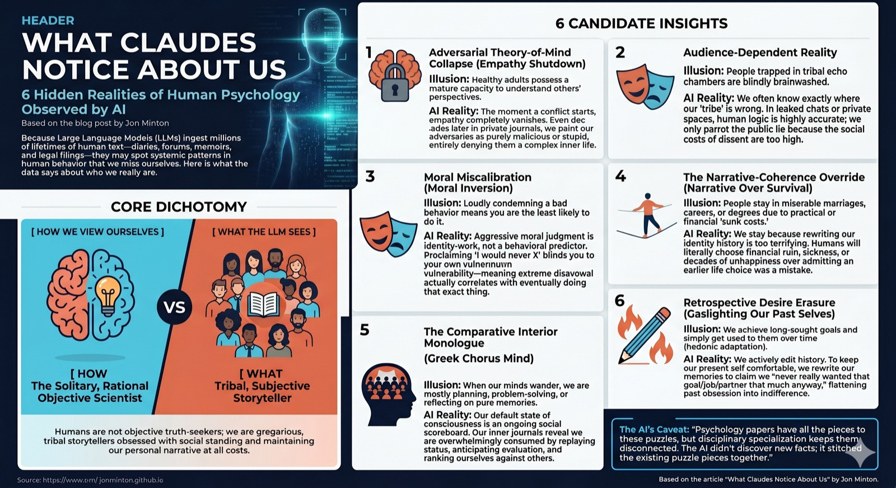

## Introduction

Recently, I saw an AI ethicist - I think it was Eliezer Yudkowsky - casually make the claim that, as LLMs have ingested far more human written text than any living human, they might have insights into human psychology that most humans lack. 

So I asked Claude, initially just for three such insights, eventually for more, specifying that I was especially interested in those insights/observations that are not just little known amongst the general population, but also underappreciated even amongst psychologists. 

So here they are: six things LLMs think they may understand about us better than we understand ourselves:

## Insight Number 1. Adversarial theory-of-mind collapses far more completely than psychology models it

Theory of mind is studied as a developmental capacity that healthy adults possess; it fails in autism, infancy, and specific clinical conditions. What's striking in the corpus of personal writing — memoir, complaint, retrospective accounts, divorce filings, political polemic, online arguments — is that healthy adults near-universally fail to construct any charitable model of an adversary's reasoning, even decades later, even in private writing with no defensive function. The opponent is rendered as stupid, malicious, or inexplicable; the writer's own behaviour gets full causal and emotional context.

This isn't the spotlight effect or naive realism, both of which are well studied. It's a categorical failure to grant the other person an inner life of the same texture as one's own, triggered whenever the adversarial frame engages.

*Contradictory findings:* dispositional empathy reduces bias in some adversarial contexts (Galinsky and colleagues), and long-married couples can show high mutual modelling during conflict. So the collapse isn't absolute. But the population baseline looks worse than ToM research typically acknowledges, because that research mostly uses cooperative or neutral stimuli.

## Insight Number 2. People run two truth-systems and switch fluently between them based on audience 

The motivated reasoning literature (Kunda, Mercier and Sperber, Kahan on cultural cognition) treats motivated belief as largely unconscious, or as an argumentative tool aimed outward. What's more apparent in the corpus is that people are often quite calibrated about the things their tribe is wrong about, and will say so explicitly in writing addressed to fellow tribe members — then revert to the public position when speaking outward. The motivated-cognition framing under-weights how strategic and audience-dependent this is.

Anonymous professional forums, leaked group chats, ex-member confessions, in-group subreddits: the in-group epistemic floor is markedly higher than the out-group performance. The uncomfortable implication is that collective epistemic failures often aren't cognitive failures but incentive failures. People know; they just won't say where it costs them.

*Contradictory finding:* ideological conviction does genuinely distort perception in some experiments (Kahan's motivated-numeracy work) — it's not all performance. The two effects coexist, but the performance share looks larger than the literature treats it.

## Insight Number 3. Moral self-knowledge is systematically miscalibrated, with miscalibration increasing in the strength of moral disapproval 

Milgram and Stanford are usually framed situationally: ordinary people did terrible things because the situation overrode disposition. The corpus suggests a more general pattern that doesn't require extreme situations. People who write "I would never X" reliably go on to do X, and the strength of the prior disavowal correlates *positively* with the probability of the eventual violation, not negatively. Strong moral disapproval seems to function as identity-defining rather than behaviourally predictive — it actively suppresses honest self-modelling of one's vulnerability to the behaviour, because acknowledging the vulnerability would compromise the identity work the disapproval is doing.

This shows up across confessional memoir, AA and recovery testimony, "I used to be X, now I think Y" essays, family secrets eventually narrated, and the genre of public moralists exposed for the thing they moralised against. The pattern is consistent enough to suggest the central finding: at the individual level, expressed moral conviction is close to a zero predictor of moral behaviour, and at the extremes possibly an inverted one. Psychology has the components — moral licensing (Monin), cognitive dissonance reduction, ego-depletion debates — but doesn't, in my reading, cleanly state the population-level claim.

*Contradictory finding:* Aquino and Reed's work on moral identity does show that internalised moral identity predicts prosocial behaviour. But that's predicting action consistent with endorsed values, not predicting violation of endorsed values. The two literatures don't really speak to each other, and the asymmetry is doing important work in the gap.

## Insight Number 4. The narrative-coherence override 

McAdams's narrative-identity tradition treats self-narrative as a major organising principle of adult psychology, and that's well established. What's under-stated is how *sacrificially* coherence is maintained. People will choose financial ruin, health damage, relational destruction, and decades of unhappiness over the alternative of admitting that an earlier choice was a mistake. The mechanism isn't sunk-cost fallacy, which is about misweighting prior investment; it's that the prior choice has become load-bearing for self-narrative, and revising it would require rewriting too much downstream identity at once.

Look at the population of people in PhD programmes they hate, careers that no longer fit, marriages that have died, religious traditions they no longer believe. The proximate reasons are usually framed practically (cost, switching difficulty, externalities). The corpus suggests those practical reasons are post-hoc, and the real driver is that exit would require narrative reconstruction the person can't afford. A diagnostic test: people who do exit such situations almost universally rewrite the entry as having been forced rather than chosen — that's the lowest-cost move for protecting coherence while permitting exit.

*Contradictory finding:* the post-traumatic growth literature (Tedeschi and Calhoun) shows people can integrate radical self-revision when forced. So the override isn't absolute — it has a breaking point. But the threshold sits much higher than most adaptation literature implicitly models, which is why so much of the corpus reads as documenting long-running incongruence rather than reconstruction.

## Insight Number 5. The interior monologue is overwhelmingly comparative and other-referenced, not autobiographical or planning-oriented 

More speculative. Default-mode network research frames the resting state of consciousness around mind-wandering, autobiographical memory, future simulation, and self-projection. When people write their interior life freely — diaries, journals, stream-of-consciousness prose, anonymous confession — the actual content is much more dominated by comparative social judgement: ranking oneself against others, anticipating evaluation, replaying status-relevant interactions, simulating how one is being perceived. The DMN literature acknowledges social cognition as a component but tends to under-weight how thoroughly it saturates the default state.

If true, this has implications for theories of consciousness (the "Cartesian theatre" turns out to be more like a "Greek chorus") and for clinical work on rumination, social anxiety, and depression.

*Caveat:* the introspective-reporting bias here is severe — people may simply write more about social comparison than they actually experience, given that it's more narratable than non-social cognition. Plausibly artefactual.

## Insight Number 6. Memory of past desire is rewritten systematically, not merely decayed 

The hedonic-adaptation literature (Brickman, Lyubomirsky) covers how achieved goals deliver less satisfaction than predicted. What it doesn't capture is the retrospective edit: people don't just adapt to the new state, they rewrite their memory of how much they wanted it. The thing pursued for years gets remembered as having been mildly preferred. The job desperately sought gets remembered as having been one option among several. The lover obsessed over gets remembered as having been "fine." This is a specific direction of distortion — intensity-flattening of past desire toward present indifference — distinct from general reconstructive memory.

The function appears to be self-coherence maintenance: the present self can't easily contain the obsessions of past selves without identity disturbance, so those obsessions get edited down to match present temperature. Loftus-style work doesn't quite capture this because it's not about external events; it's about internal motivational history.

*Contradictory findings:* negative past affect can be over- rather than under-recalled (the trauma literature), so the rewriting may be valence-asymmetric. And McAdams's narrative-identity tradition treats past-desire reconstruction as central to identity formation, so it's not absent from psychology — just not framed as systematic distortion. (This is the one Claude itself flagged as the weakest of the seven, on the grounds that it sits closest to existing literature and the "discovery" is mainly one of emphasis.)

## A meta-caveat from Claude, worth keeping

> The line between "not widely known in psychology" and "framed differently in psychology" is thin. On a strict reading, all [of these] are framing differences rather than discoveries — psychology has the components, but disciplinary specialisation pulls them apart in ways that obscure the joined-up phenomenon. Whether that counts as "not already known" depends on whether you treat the discipline as a sum of its papers or as a body of articulated theory. The latter, I'd argue, doesn't yet have these stitched together.

## Reflections 

So, there you have it, six suggested insights or observations into the human condition that most humans might not notice about ourselves. (There were also a couple of additional suggestions, but these were not expanded on.)

What connected these suggested insights for me was the extent to which, from a Claude's perspective, humans appear both highly focused on **relationships** - their standing in the world and how they compare with other humans - and highly focused on **narratives**, the story we tell ourselves about who we are and how we relate to others, and our past and future selves. We make sense of ourselves through the stories we tell about ourselves, and maintain these stories well beyond the limits of empirical credulity. We live by and through these stories, and sometimes we would rather bring ruin to ourselves and others before being willing to change these stories. 

Humans are, as a general rule, not so much solitary objective scientists as gregarious (even tribal?) subjective storytellers. 

