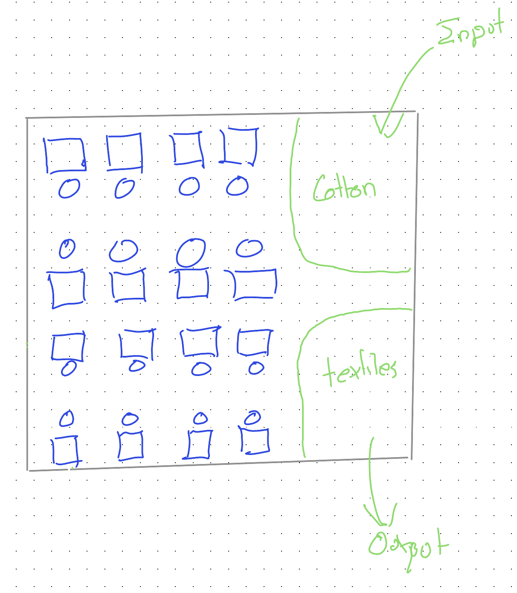
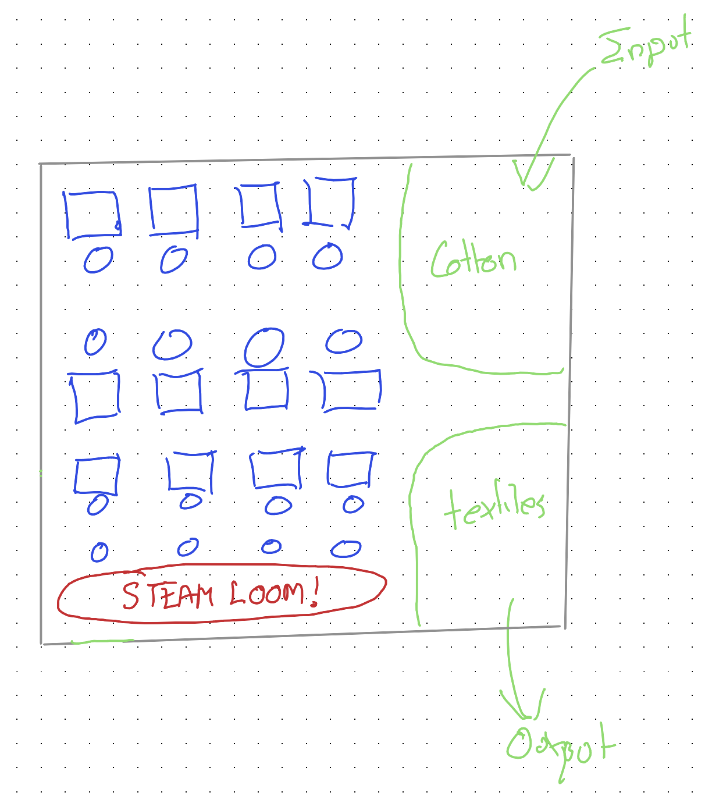
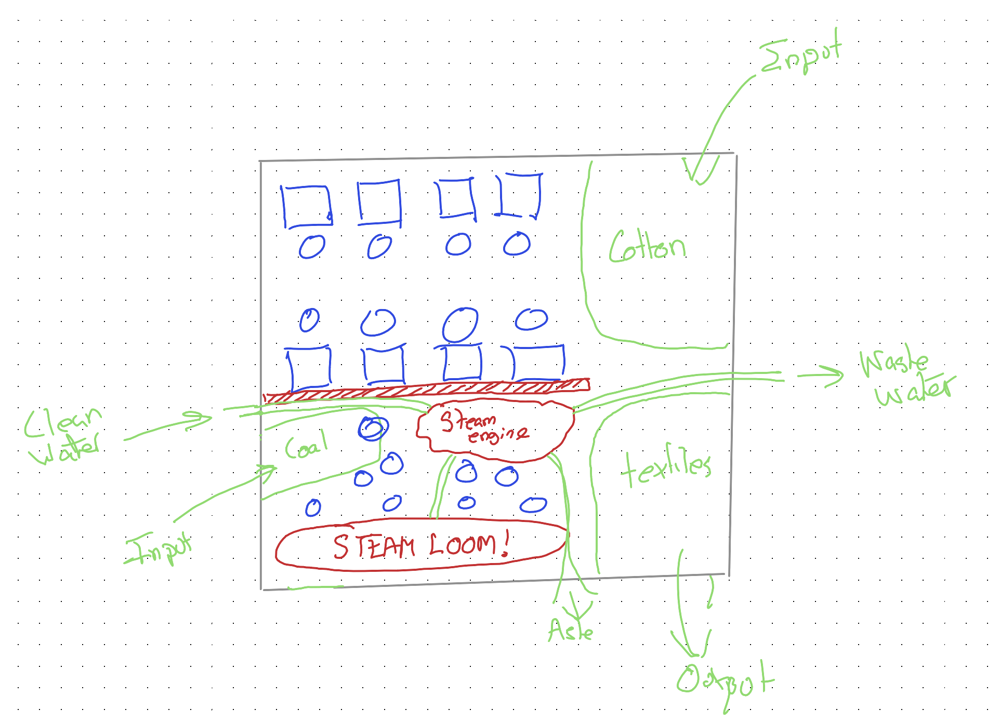
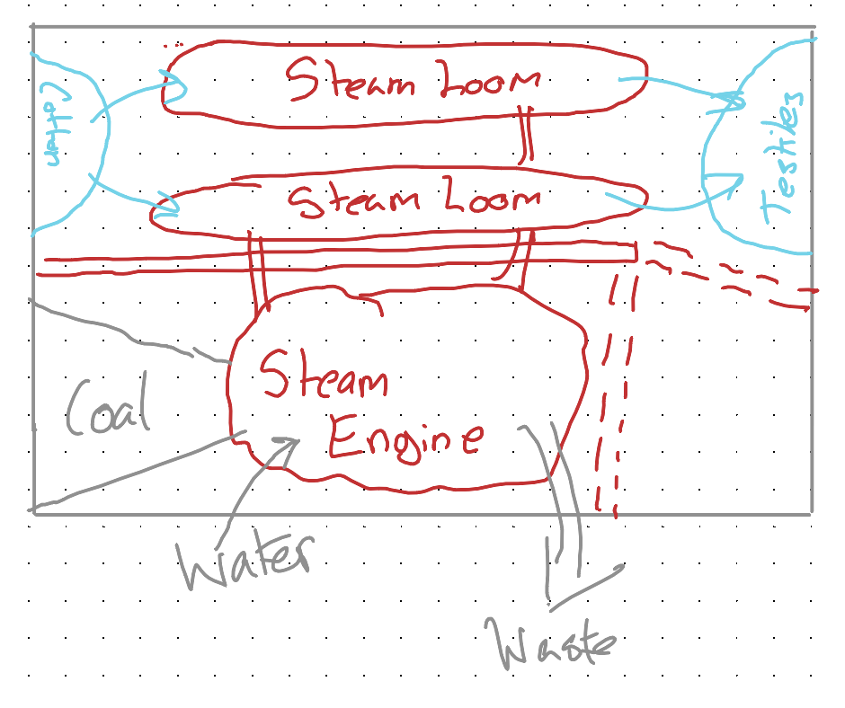
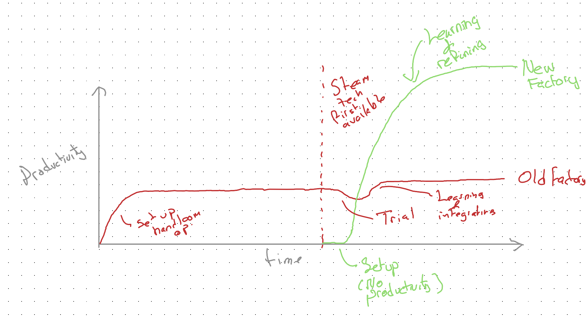

Imagine you're a factory owner in the 1700s, prior to the start of the Industrial Revolution. Your company makes cloth. Your factory has one workstation per worker. Each worker operates — and powers — a loom.

Your setup looks a bit like this:

One factory. Sixteen workstations. Sixteen human workers. One input resource: cotton.

## The cautious experiment

Now imagine the factory owner wants to explore the new-fangled steam technology. But only cautiously and incrementally. Rather than going all in on this unproven technology, he converts just a portion of the factory — replacing four handlooms with a single steam-powered loom.

The four handloom operators from the bottom row are now in charge of making the steam loom *work*.

## What could go wrong?!

Quite a lot, as it turns out.

1. **Skills mismatch.** The handloom operators don't know how steam engines and steam looms work. Though they try hard, they don't know how to use and maintain the steam loom. They're weavers, not engineers.

2. **Disruption to existing workers.** The handloom operators on neighbouring rows really don't like the noise and disruption caused by the steam loom. It's distracting and polluting, and affects their productivity and workplace quality of life.

3. **Logistical complexity.** The steam loom needs a steam engine, and the steam engine needs coal and water to work. Instead of the factory having one input resource to manage — cotton — they now have three: water, coal, and cotton. Because of this additional complexity, the factory needs to recruit another staff member just for handling logistics and building relationships with three different types of supplier.

4. **Contamination.** It's quickly identified that coal shouldn't be kept near cotton or textiles: it makes them dirty, harder to work with, less valuable, harder to sell. Because of this, even more of the factory has to be reconfigured to keep the coal separate from the raw and finished product.

Because of these and related issues, the degree of disruption and change to the factory turns out to be *far* more than the incrementalist factory owner initially assumed:

Either the factory owner would have stopped the experiment before more than half the factory got turned over to meeting the needs of the steam loom, or they'd have reached this point — and realised that, after all this cost and effort and expense, the net result of all this disruption is **lower output at greater cost**.

From the factory owner's perspective, they'd done their due diligence. They adopted an appropriately cautious, experimental and incremental approach to investigating whether the new technology was right for them, and concluded — with strong evidence — that it was a waste of time and resources.

## What did the factory owner do wrong?

::: {.callout-important}
## The crux of the problem

In principle, **nothing**. They did everything right. And their decision to revert to all handlooms was based on the best available evidence and an unbiased assessment of the new technology's benefits and costs.

The experiment gave the correct answer about the hybrid state — *bolting steam onto a handloom factory doesn't work* — while giving the **wrong** answer about the technology itself.
:::

This is the *can't-get-there-from-here* dilemma. The only route from the old way to the new passes through a valley that looks like evidence the new way doesn't work.

The factory owner is stuck at a **local optimum**: the best achievable outcome *given their current setup*. Every incremental step away from it makes things worse. But there exists a *global* optimum — a far more productive configuration — that can only be reached by starting from a blank page, not by incremental modification of what already exists.

## The upstart advantage

Now imagine what would happen if, instead of following the incumbent's journey, we follow the upstart's.

The upstart, in normal times, begins with all the disadvantages: no existing expertise, no machinery, no capital, no customers. But in *abnormal* times — when there are genuinely disruptive technologies — the lack of expertise, resource, and path dependence all become advantages.

The upstart can start with a blank page. An empty field. They can decide how to design their production facilities *around* the new technology. They can choose their factory location, design the plant layout, hire employees with the right skills and roles — all built from the ground up for the new paradigm. They are not bound by the need for piecemeal incrementalism. They have a *tabula rasa*.

With the newcomer:

- The factory is located with all three resources — coal, water and cotton — in mind.
- The "dirty" part of the factory is separated from the "clean" part, meaning less contamination of the product.
- There may be fewer employees, but they are more specialist and better paid.
- Every element of the operation is designed to work *with* the technology, not around it.

## The valley between peaks

Let's imagine the productivity of the two factories over time:

Both incumbent and newcomer adopted the same new technology. But for the incumbent, this led initially to declines in productivity, and then — if they persisted — only to marginal gains. The newcomer also adopted the new technology, but built their entire workflow, logistics, and infrastructure around it. As a result, they were eventually able to achieve *far* greater productivity than the old factory ever could.

This is the **valley between peaks**. The incumbent stands on one peak and looks across to a higher one, but the path between them descends into a valley that looks — to every rational metric — like failure. The incrementalist quite reasonably turns back. The newcomer never enters the valley at all: they start building on the other side.

Over time, the industry itself becomes dominated by modes of production based around the new technology. But this doesn't tend to occur through successful adoption by incumbents. Instead, it occurs mainly through the newcomers — native to the new technology — outcompeting the incumbents by building their entire mode of production around it.

## So what can the incumbent do?

If experimental incrementalism won't work, incumbents aren't entirely without options:

- **Build a pseudo-newcomer.** Divert some profits to constructing an entirely new operation — new facility, new staff — who, like the newcomer, start with a blank page and a clear vision of the new technology's potential. Don't bolt the new onto the old. Build the new *next to* the old.

- **Buy out the newcomer.** At some point, it should be clear that a newcomer will become a highly disruptive competitor. But so long as the incumbent acts quickly enough — and knows the difference between a newcomer who is genuinely using the new technology effectively versus one selling hype — they can acquire the newcomer before they get too big. This means paying generously, based on expected future productivity rather than currently realised productivity.

Both options require something the cautious incrementalist finds deeply uncomfortable: spending significant resources on something that isn't yet proven by their own experience. But that discomfort is itself the trap. The incrementalist's evidence is real but misleading — it tells them the truth about the hybrid, while obscuring the truth about the technology.

Which of these options is your organisation pursuing? [^1]

[^1]: This question was added by Claude! 
